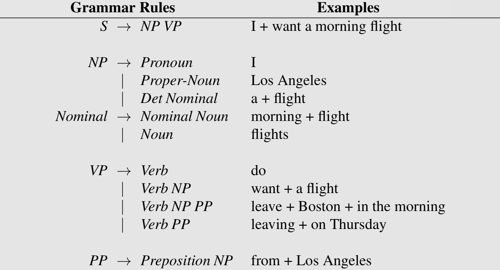
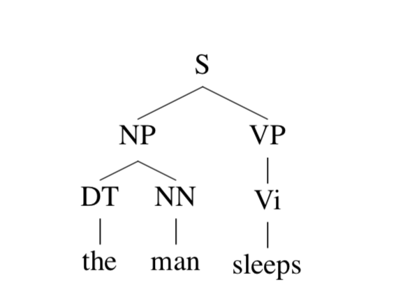
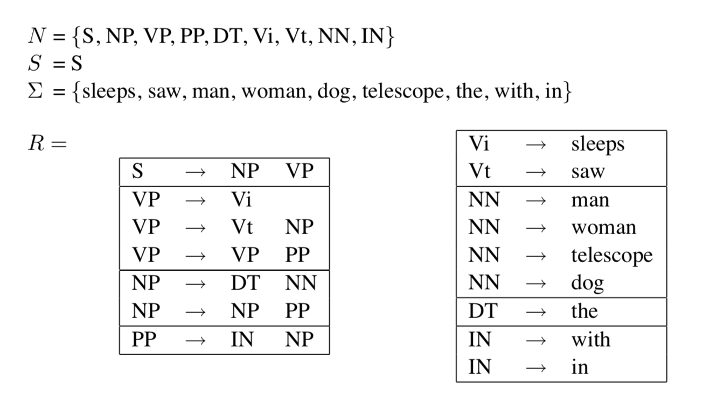
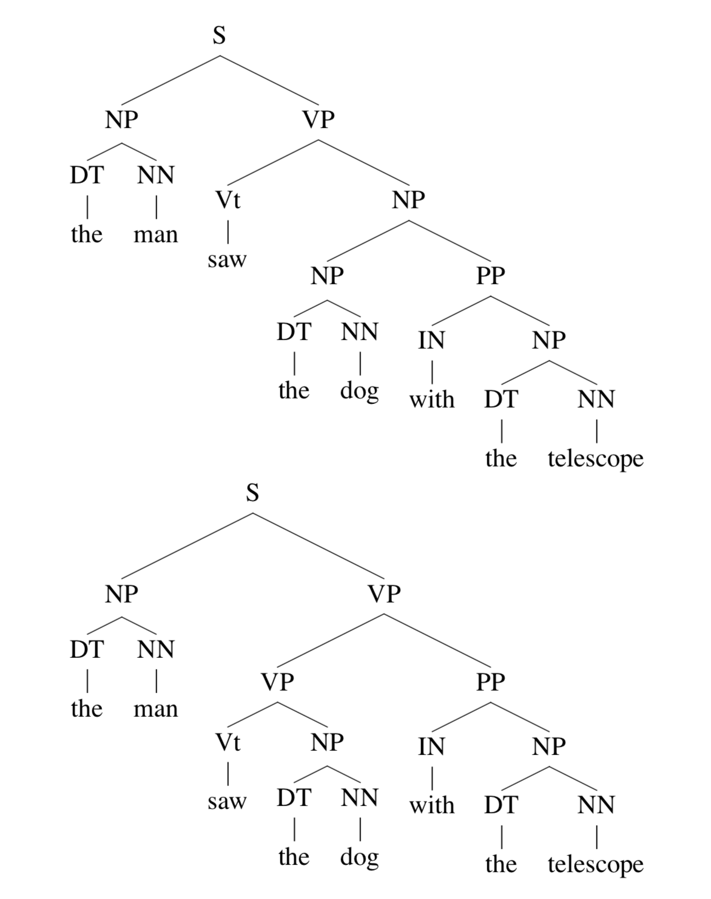
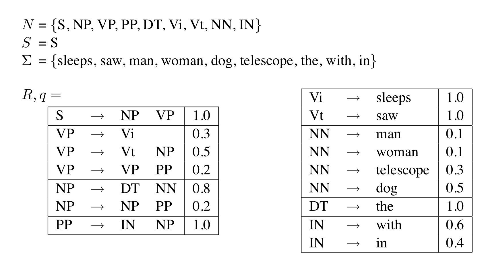
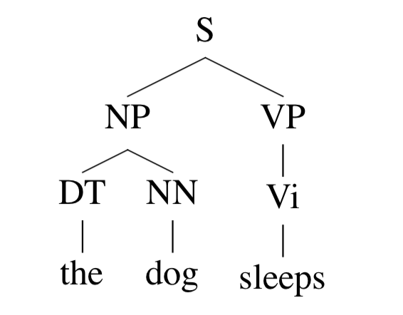

在 NLP 任务中，我们可以根据一组 grammar 规则来生成一个句子。

下面这个 grammar 例子表示，一个句子能够由名词短语 I 和动词短语 want a morning filght 组成；名词短语能够由代词 I 组成，或由名词 Los Angeles 组成等。

## Context-Free Grammar(CFG)

什么是“上下文无关”？

考虑下图这个 parse tree（语法树）：

我们来模拟一下这句话生成的过程：

1. S $$\rightarrow$$ NP VP
2. S $$\rightarrow$$ NP VP  $$\rightarrow$$ DT NN VP
3. S $$\rightarrow$$ NP VP  $$\rightarrow$$ DT NN VP  $$\rightarrow$$  the NN VP
4. S $$\rightarrow$$ NP VP  $$\rightarrow$$ DT NN VP  $$\rightarrow$$  the NN VP  $$\rightarrow$$ the man VP
5. S $$\rightarrow$$ NP VP  $$\rightarrow$$ DT NN VP  $$\rightarrow$$  the NN VP  $$\rightarrow$$ the man VP  $$\rightarrow$$ the man Vi
6. S $$\rightarrow$$ NP VP  $$\rightarrow$$ DT NN VP  $$\rightarrow$$  the NN VP  $$\rightarrow$$ the man VP  $$\rightarrow$$ the man sleeps

在第一步到第二步时，DT 和 NN 的生成只与 NP 有关（根据 NP $$\rightarrow$$ DT NN 这条规则），而与 VP 无关，也就是说，**所有规则的左侧只有一个符号**，这种形式为**上下文无关**。

### CFG 定义

CFG 由一个四元组 $$N$$，$$ \Sigma$$，$$R$$，$$S$$ 组成。其中，

- $$N$$ 是 non-terminal 符号的集合，理解为语法树中的非叶节点（S、NP……）
- $$ \Sigma$$ 是 terminal 符号的集合，也就是各个单词（叶节点 the、man、sleeps）
- $$R$$ 代表 grammar 中的规则，如 S$$\rightarrow$$ NP VP
- $$ S$$ 代表开始的标记，也就是语法树的根节点

上面例子的语法树根是根据下面这个 grammar 生成的。由一句话和一个 grammar 生成 parse tree 的过程叫做 **parsing**。由于句子是由 grammar 生成的，因此这种建模方法也被称为 generative grammar。

现在我们使用这个 grammar 来生成这样一句话，the man saw the dog with the telescope，我们看看会产生什么样的 parse tree 呢？

看，两个 parse tree 都是有效的，但却是两种语义。为了解决这种歧义的现象，我们在 CFG 中引入了概率的概念。

## Probabilistic Context-Free Grammar(PCFG)

给定一个上下文无关语法 $$G$$，称 $$\mathcal{T}_{G}$$ 为 grammar $$G$$ 下的所有 parse tree 的集合，简写为 $$\mathcal{T}$$。那么就有 

$$
\sum_{t\in\mathcal{T}_{G}}p(t)=1
$$

因此如果知道了概率分布 $$p(t)$$，那么我们就可以通过排序找到一句话最有可能的 parse tree。

### PCFG 定义

1. 一个上下文无关语法 $$G=(N,\Sigma,S,R)$$
2. 对应每个规则 $$\alpha\rightarrow\beta\in R$$ 的概率为 $$q(\alpha\rightarrow\beta)$$，实际上这是在给定$$\alpha$$ 为规则左侧符号时，$$\alpha\rightarrow\beta$$ 这条规则的条件概率。因此在任意 $$X\in N$$ 时，有 $$\sum_{\alpha\rightarrow\beta\in R:\alpha=X}q(\alpha\rightarrow\beta)=1$$

因此，如果一个parse tree $$t\in\mathcal{T}_{G}$$ 包含$$\alpha_{1}\rightarrow\beta_{1},\alpha_{2}\rightarrow\beta_{2},…,\alpha_{n}\rightarrow\beta_{n}$$这些规则，那么这个 PCFG 的概率为
$$
p(t)=\prod_{i=1}^{n}q(\alpha_{i}\rightarrow\beta{i})
$$

如图所示，满足
$$
\begin{eqnarray}
\sum_{\alpha \rightarrow \beta\in R:\alpha=\mathrm{VP}}q(\alpha \rightarrow \beta) &=& q(\mathrm{VP} \rightarrow \mathrm{Vi})\;+\;q(\mathrm{VP} \rightarrow \mathrm{Vt}\;\;\mathrm{NP})\;+\;q(\mathrm{VP} \rightarrow \mathrm{VP}\;\;\mathrm{PP}) \nonumber \\
&=& 0.3\;+\;0.5\;+\;0.2 \nonumber \\
&=& 1.0 \nonumber
\end{eqnarray}
$$

如果 parse tree 是这样：

那么这个parse tree的概率就是

$$
p(t)=q(\mathrm{S}\rightarrow \mathrm{NP\;\;VP})\times q(\mathrm{NP}\rightarrow \mathrm{DT\;\;NN})\times q(\mathrm{DT}\rightarrow \mathrm{the})  \times q(\mathrm{NN}\rightarrow \mathrm{dog})\times q(\mathrm{VP}\rightarrow \mathrm{Vi})\times q(\mathrm{Vi}\rightarrow \mathrm{sleeps})
$$

## References

- [http://www.cs.columbia.edu/~mcollins/courses/nlp2011/notes/pcfgs.pdf](http://www.cs.columbia.edu/~mcollins/courses/nlp2011/notes/pcfgs.pdf)
- *Speech and Language Processing*, chapter 11