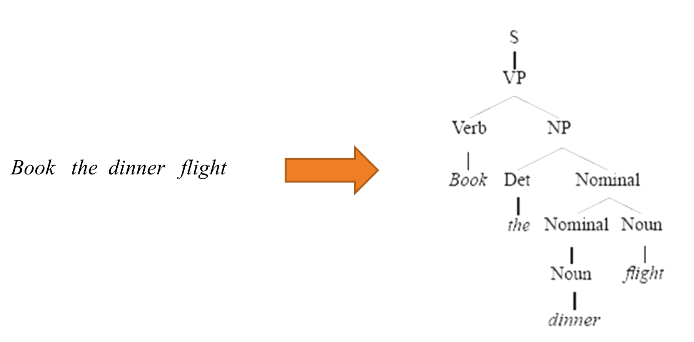
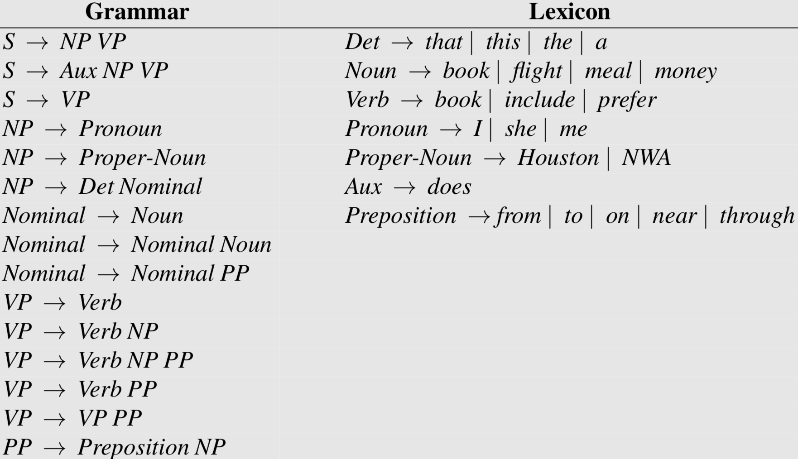
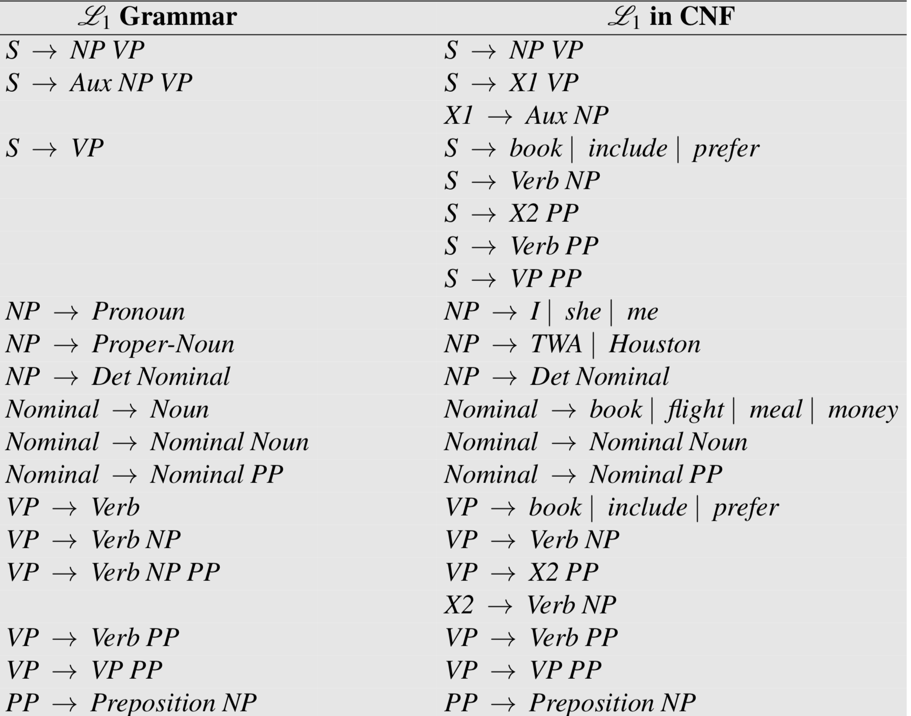
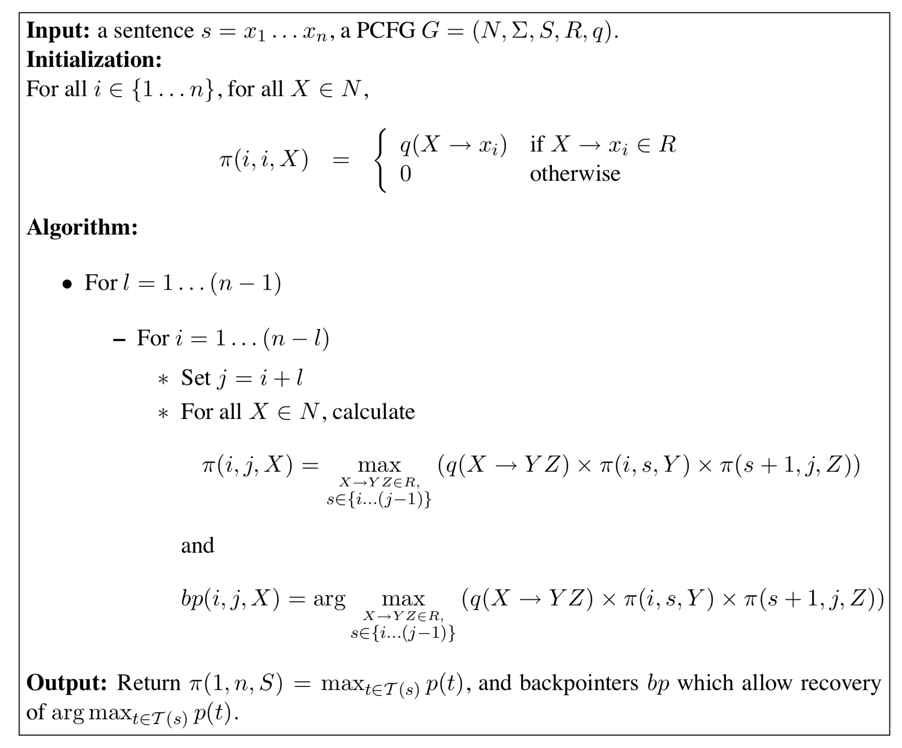

在 [介绍 PCFG](https://arminli.com/blog/194) 这篇文章中，我们提到了 parsing。parsing 的任务是根据 grammar 找到句子对应的合适的 parsing tree：

本文介绍的 CYK 算法就是寻找 parsing tree 的一种动态规划算法（CYK 是三个人名字的首字母）。

### Chomsky Normal Form

CYK 算法要求使用的 grammar rule 必须遵守 Chomsky 范式（Chomsky Normal Form, CNF）：

1. $$X\rightarrow Y_{1}Y_{2} \;\; X,Y_{1},Y_{2}\in N$$
2. $$X\rightarrow Y\;\;X\in N,Y\in\Sigma$$

实际上，任何由上下文无关语法都能由重写规则为 CNF 的语法生成，比如：

$$
A \rightarrow B \; C \; D
$$

可以被重写为下面的 CNF 规则：

$$
A \rightarrow B \; X \\
X \rightarrow C \; D
$$

因此，CNF 保证了其对应的 parsing tree 是二叉树。

下图是一个 CNF 重写示例：

## CYK Algorithm

输入：满足 CNF 的 PCFG $$G=(N,\Sigma,S,R,q)$$，一个句子 $$s=x_{1}…x_{n}$$ ，其中 $$x_{i}$$ 代表第 $$i$$ 个词。

输出为：

$$
\arg \max_{t\in \mathcal{T}_{G}(s)}p(t)
$$

也就是 parse tree 概率最大的那句话（以及 parse tree 结构）。

定义 $$\mathcal{T}(i,j,X)$$ 为以 $$X$$ 为 parse tree 根节点，扩充到 [i,j] 这几个词所有可能的 parse tree 集合，定义 $$\pi(i,j,X)$$ 为其中概率最大的 parse tree 对应的概率，那么我们实际上要求的就是 $$\pi(1,n,S)$$ 。

CYK 算法是自底向上的，因此对于 $$i=1…n, X\in N$$ 时，有

$$
\begin{eqnarray}
\pi(i,i,X) &=&
\begin{cases}
q(X \rightarrow x_{i})& \text{if $X\rightarrow x_{i}\in R$}\\
0& \text{otherwise}
\end{cases} \nonumber
\end{eqnarray}
$$

也就是为最底层与单词有关的规则的概率做初始化，这很容易理解，接下来就是 DP 算法中的状态转移方程：

$$
\pi(i,j,X)=\max_{X \rightarrow Y\,Z\in R, s\in\{i...(j-1)\}}(q(X\rightarrow Y\;Z)\times \pi(i,s,Y)\times \pi(s+1,j,Z))
$$

其中 $$(i,j)$$ 满足 $$1\leq i < j \leq n$$ 。

这个方程的意思是说，如果存在 $$X\rightarrow Y\;Z$$ 这条规则并且 $$Y$$ 能扩散到 $$i$$ 和 $$s$$ 两个词，$$Z$$ 能扩散到 $$s+1$$ 和 $$j$$ 两个词，这样就包括了整句话，因此以 $$X$$ 为根节点的 parse tree 的概率也能够求得，由于可能有多种可能，因此要取最大值。

这里有一个 CYK 算法的在线 demo，[CYK demo](http://lxmls.it.pt/2015/cky.html)。

整个过程的伪代码如图：

## References

- [http://www.cs.columbia.edu/~mcollins/courses/nlp2011/notes/pcfgs.pdf](http://www.cs.columbia.edu/~mcollins/courses/nlp2011/notes/pcfgs.pdf)
- *Speech and Language Processing*, chapter 12
