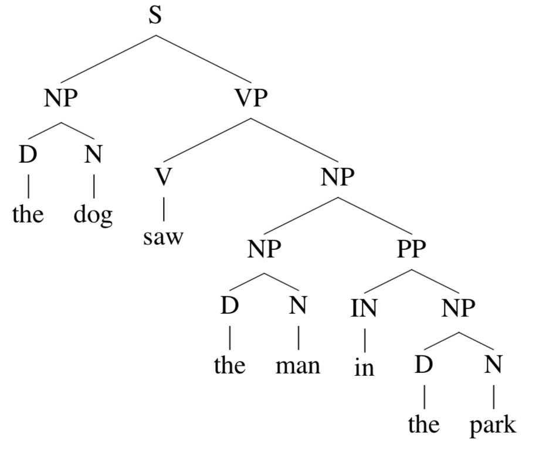
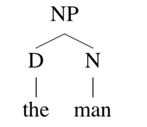
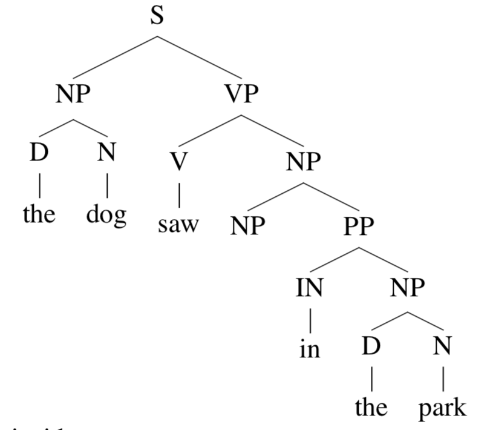
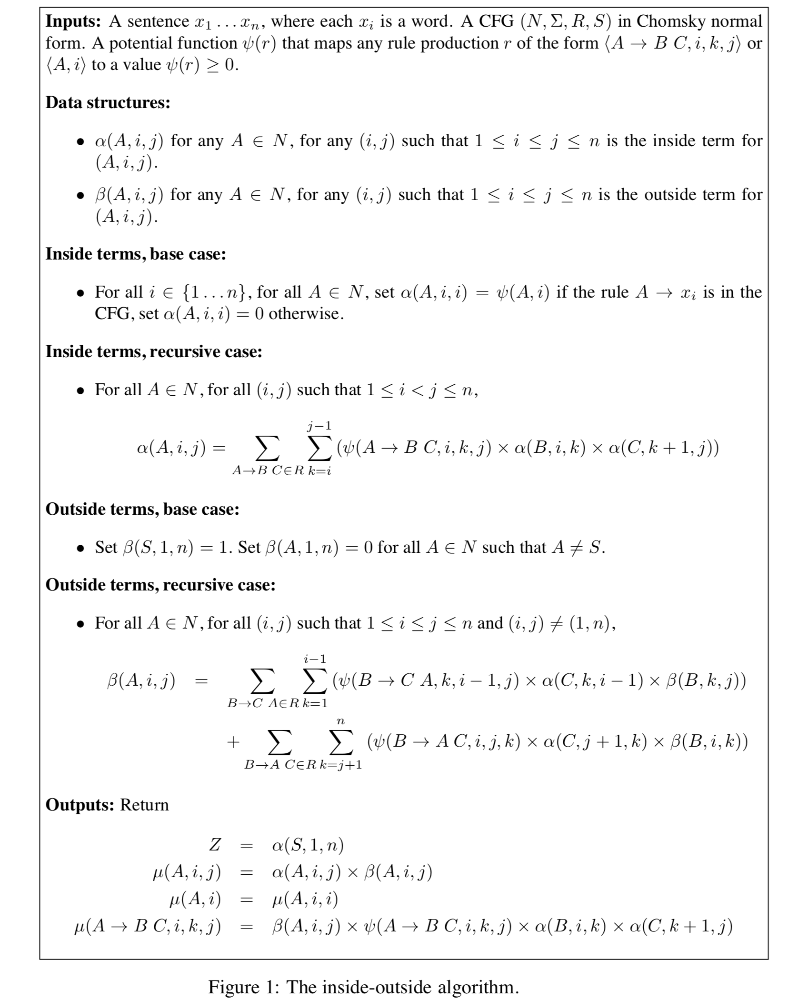
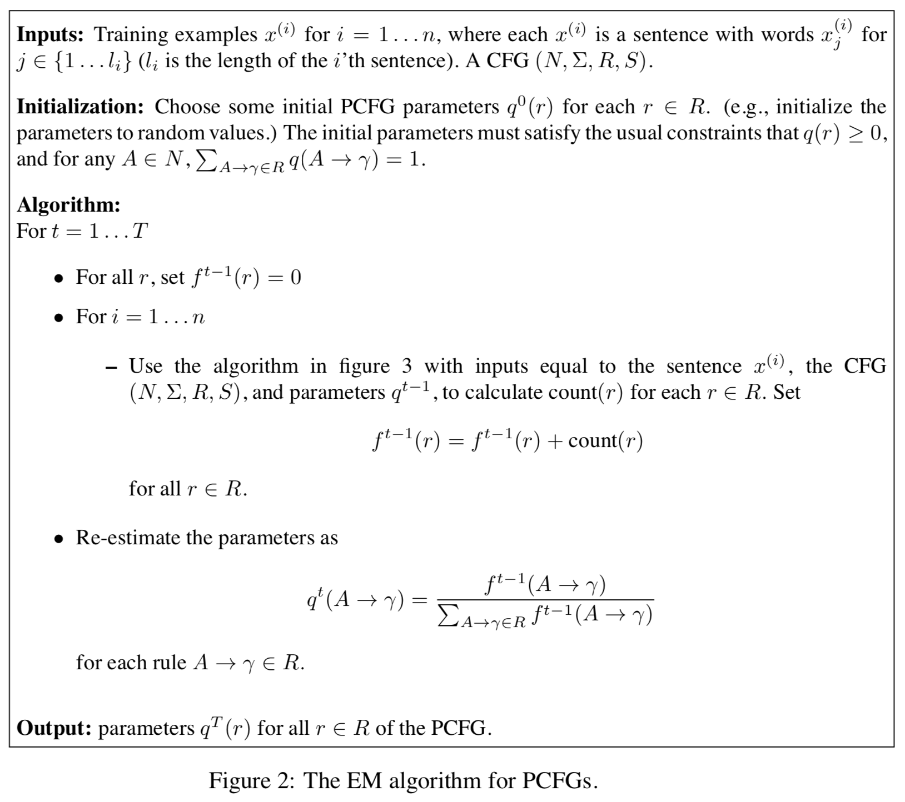
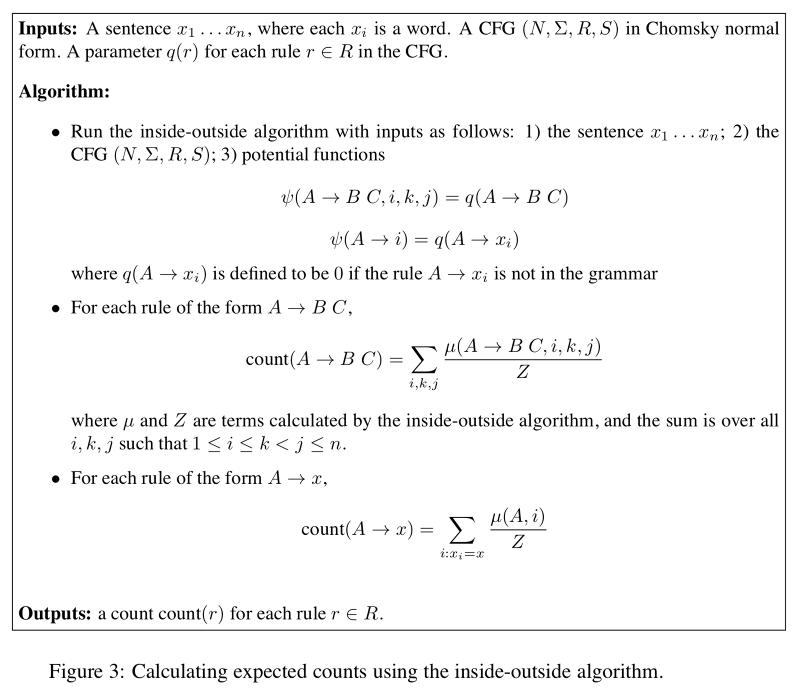

[上篇文章](https://arminli.com/blog/195)中介绍了一种 parsing 算法 CYK，这篇文章要介绍的 inside-outside 是另一个 parsing 算法。

## 算法输入

- 一句话 $$s=x_{1}…x_{n}$$
- 满足 CNF 的 CFG
- potential function

什么是 potential function？

对于一个规则 $$r$$ ，使用 $$\psi(r)$$  代表这个规则的 *potential*，在这里也就是概率：

$$
\psi(A\rightarrow B \; C,i,k,j)=q(A\rightarrow B \; C)
$$

$$
\psi(A,i)=q(A\rightarrow x_{i})
$$

因此对于一个 parse tree t ，它的概率为 $$\psi(t)=\prod_{r\in t}\psi(r)$$.

## 算法输出

$$Z=\sum_{t\in \mathcal{T}}\psi{(t)}$$  表示**所有可能的 parse tree 的概率和**。

对于所有规则 $$r$$, 定义

$$
\mu(r)=\sum_{t\in\mathcal(T):r\in t} \psi(t)
$$

也就是**所有包括规则 $$r$$ 的 parse tree 概率和**。

以及对于 $$A\in N, 1 \leq i \leq j \leq n$$，

$$
\mu(A,i,j) = \sum_{t\in\mathcal(T):(A,i,j)\in t}\psi(t)
$$

也就是所有parse tree 中，以 $$A$$ 为根节点，叶节点扩散到 $$x_{i}…x_{j}$$ 这些单词的**子树的概率和**。

我们使用 $$\alpha(A,i,j)$$ 和 $$\beta(A,i,j)$$ 分别代表 inside 和 outside 算法。

## Inside

inside 算法实际上就是把 CYK 中对所有 parse tree **取最大概率的操作换成了求和**。

即

$$
\alpha(A,i,j)=\sum_{t\in \mathcal{T}(A,i,j)}\psi(t)
$$

以这个 parse tree 为例：

它关于 $$(\mathrm{NP},4,5)$$ 的 inside tree $$t_{2}$$就是

同样地，outside tree $$t_{1}$$是

这个 outside tree 根节点是 $$S$$，叶节点是 $$x_{1}…x_{3} \; \mathrm{NP} \; x_{6}…x_{n}$$

易知

$$
\psi(t)=\psi(t_{1})\times \psi(t_{2})
$$

## Outside

由上述定义知，对于一个 outside tree $$t$$ ，它的 potential 为 $$\psi(t)$$，也就是这个 tree 里所有规则的乘积。

我们使用符号 $$\mathcal{O}(A,i,j)$$ 来代表所有可能的 outside tree 的集合（以 $$A$$ 为根节点，扩散到 $$i$$ 和 $$j$$ 之间的所有单词），那么
$$
\beta(A,i,j) = \sum_{t\in \mathcal{O}(A,i,j))}\psi(t)
$$

也就是说，$$\beta(A,i,j)$$ 是所有 $$\mathcal{O}(A,i,j)$$ 中 potential 的和。

根据上述定义推出一些性质：

$$
Z=\sum_{t\in \mathcal{T}}\psi{(t)}=\alpha(S,1,n)
$$

$$
\begin{eqnarray}
\mu(A,i,j) &=& \sum_{t\in\mathcal{T}:(A,i,j)\in t}\psi(t)\\
&=&\sum_{t_{1}\in\mathcal{O}(A,i,j)}\sum_{t_{2}\in \mathcal{T}(A,i,j)}(\psi(t_{1})\times\psi(t_{2}))\\
&=&\left(\sum_{t_{1}\in\mathcal{O}(A,i,j)}\psi(t_{1})\right)\times\left(\sum_{t_{2}\in\mathcal{T}(A,i,j)}\psi(t_{2})\right)\\
&=&\alpha(A,i,j)\times\beta(A,i,j)
\end{eqnarray}
$$

Inside-outside 算法的全部过程如图：

## PCFG 中的 EM 算法

在[掷硬币中的 EM 算法](https://arminli.com/blog/193)中我们介绍了 EM 算法，EM 算法在 PCFG 中起着非常重要的作用，它的实质是参数的更新。

算法的输入有 $$n$$ 个训练样本（n 句话），例如 $$x^{(i)}_{1}$$ 代表第 $$i$$ 个样本中的第一个单词。

设 $$\mathcal{T}_{i}$$ 为第 $$i$$ 轮迭代时所有可能的 parse tree，$$q(r)$$ 为规则 $$r$$ 的参数（概率），

初始 $$q^{0}(r)$$ 可以设为随机值，然后算出 $$q^{1},q^{2},…$$ 直到收敛。

$$q$$ 的更新过程如下，首先需要算出在 $$t-1$$ 次迭代时 $$q^{t-1}$$ 下的 *expected counts* $$f(r)$$ ，那么 $$q^{t}$$就能求得：

$$
q^{t}(A\rightarrow\gamma)=\dfrac{f(A\rightarrow \gamma)}{\sum_{A\rightarrow\gamma\in R}f(A\rightarrow\gamma)}
$$

那么如何计算 $$f(r)$$ 呢？

## Expected Counts

设$$\mathrm{count}(t,r)$$ 为规则 $$r$$ 出现在 $$t$$ 中的次数，$$\underline{\theta}$$ 是代表所有规则概率的 vector，那么有

$$
f^{t-1}(r)=\sum^{n}_{i=1} \sum_{t\in \mathcal{T}_{i} } p(t|x^{i};\underline{\theta}^{t-1})\mathrm{count}(t,r)
$$

第一个求和代表所有的训练样本，对于每个训练样本，再求和所有可能的 parse tree。对于每个 parse tree，将条件概率与 count 二者相乘。

因此对于单个训练样本，

$$
\mathrm{count}(r)=\sum_{t\in \mathcal{T}_{i} } p(t|x^{i};\underline{\theta}^{t-1})\mathrm{count}(t,r)
$$

可以使用 inside-outside 算法计算 $$\mathrm{count}(r)$$ ，如图：

## References

- [http://www.cs.columbia.edu/~mcollins/courses/nlp2011/notes/pcfgs.pdf](http://www.cs.columbia.edu/~mcollins/courses/nlp2011/notes/pcfgs.pdf)
- [http://www.cs.columbia.edu/~mcollins/io.pdf](http://www.cs.columbia.edu/~mcollins/io.pdf)