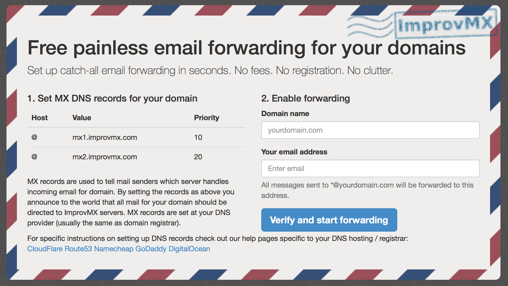

很多人都拥有自己的域名，使用自己的域名邮箱是一件很酷的事情。现在阿里和腾讯等邮箱服务商都推出了企业邮箱，也有 [Zoho](http://zoho.com.cn/mail/) 、[Yandex](https://www.yandex.com) 等国外服务商提供的域名邮箱，甚至可以使用开源的实现在 VPS 上搭建邮箱服务。但最便捷的方式还是使用 [ImprovMX](http://improvmx.com/) 这类通过设置 DNS 解析的邮件转发服务。

ImprovMX 的使用非常简单，首先向 DNS 中添加两条MX 记录，下面对很多常用的服务商的 DNS 设置给出了详细教程，然后填入域名和被转发到的邮箱地址即可。

设置完成后，所有发往 *@livc.io 的邮件都会被转发到记录的邮箱，但 ImprovMX 的缺点也很明显：

1. 不能修改填入的邮箱地址
2. 不能使用域名邮箱回邮件
3. 转发速度非常慢！！！大约一两个小时才能收到。

也有一些类似的服务比如 <https://forwardmx.io> 也是做类似的事情，不过是收费的。

另外最近才知道，对于邮箱前缀，livc 和 l.ivc 和 li.vc 和 liv.c 和 li…vc 等，加不加点都是一样的，同样地对于加号，如果前缀是 livc+cn, livc+us 等，他们和 livc 是等效的，参考 <https://www.v2ex.com/t/235567> 。

