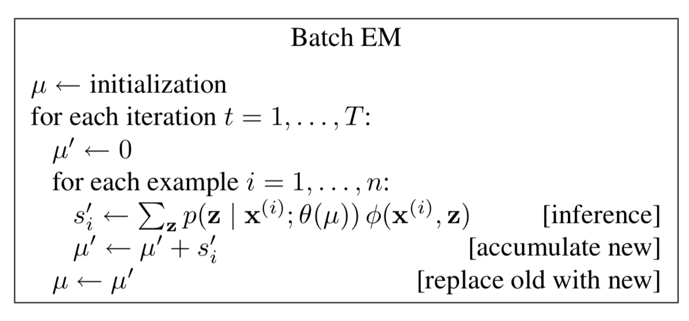
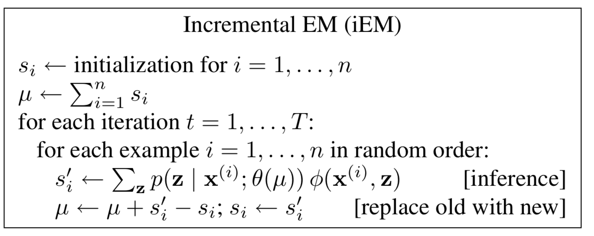
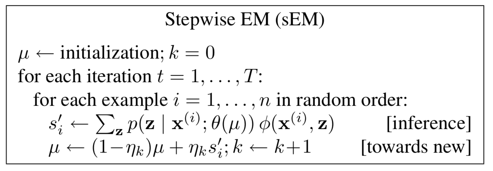

EM 算法有很多变体。一次使用所有数据训练的称为 batch em，但它收敛的很慢，online em 能够让收敛速度明显加快，并达到更好的效果。

这篇文章讨论两种 online em 方法，分别是 incremental EM 和 stepwise EM，这两种方法都是每个样本或每个 mini-batch 后做参数更新。

对于 stepwise em 来说，好的 stepsize（后面会介绍）和 mimi-batch 大小十分重要，以词性标注实验为例，stepwise em 在两次迭代后达到 65.4% 的准确率而 batch em 在 100 次迭代后只能达到 57.3%。

如果比较最终收敛时的效果，可以使用一句话来总结：**online em 能够更快地达到收敛，但不会取得比 batch em 更好的效果。**

## Batch EM

概率模型 $$p(\mathrm{x},\mathrm{z};\theta)$$ 中的 $$\mathrm{x}$$ 是输入（比如一句话），$$\mathrm{z}$$ 是输出（比如一个parse tree），$$\theta$$ 是参数分布（比如 grammar rule 概率），而 $$\mu$$ 是充分统计量，可以理解为求解的目标（比如 parse tree 中 rule 的次数）。

batch em 很简单，在 e-step 使用所有样本计算出 $$\mu^{'}$$ ，在 m-step 使用 $$\mu^{'}$$ （一个 batch 后赋值给 $$\mu$$）重新估计参数。由于 m-step 的计算很简单，所以表中把它包括在了 $$\theta(\cdot)$$ 中，没有单独列出这个计算步骤。

## Online EM

在 online em 中，对第 i 个样本会计算一个充分统计量 $$s_{i}^{'}$$ ，根据如何把新的 $$s_{i}^{'}$$ 更新到 $$\mu$$ 上的方法分为两种主要的变体。

第一种就是 incremental EM(iEM)。在 iEM 中，首先要把 $$\mu$$ 初始化为所有样本对应 $$s$$ 的和，在处理每个样本时需要加上 $$s_{i}^{'}$$ 后减去旧的 $$s_{i}$$，然后更新 $$s_{i}$$ 。

在 Stepwis EM(sEM) 中，引入了 stepsize $$\eta_{k}$$，其中 k 是 $$\mu$$ 已经更新的次数。

这个$$\eta$$ 实际上是一个衰退的过程，也就是在不断学习中要适当忘记旧的统计量。stepsize 一般采用 $$\eta_{k}=(k+2)^{- \alpha}$$, $$0.5< \alpha \leq 1$$。这个 $$\alpha$$ 被称为衰退指数，$$\alpha$$ 越小，$$\eta_{k}$$ 越大，保留旧的 $$\mu$$ 就越少，也就是忘的更快。

在实际训练中很少一个样本一个样本做参数更新的，一般使用一个 mini-batch 来更新，设这个 mini-batch size 为 $$m$$。

作者在四个应用上进行实验：POS tagging, Document classification, Word segmentation, Word alignment。结论是与 batch em 相比，在前两个任务中，sEM 能取得更好的效果和更快的速度（**相同 iterations**），然而在后两个实验中效果并没有太大差别。

作者认为，在一些任务上 sEM 能够提升 accuracy ，比如说 POS tagging 和 Document classification 这种“聚类”任务，这种任务会有一个潜在的 label。然而在 Word segmentation 和 Word alignment 这种“结构”任务中，驱动训练的是组合结构（segmentations 和 alignments），不能达到更好的效果。

在参数的选择上，作者观察到更大的 batch size （$$m$$ ）和更小的 stepsize （$$\alpha$$） 会带来更好的效果。

## Reference

- https://cs.stanford.edu/~pliang/papers/online-naacl2009.pdf
