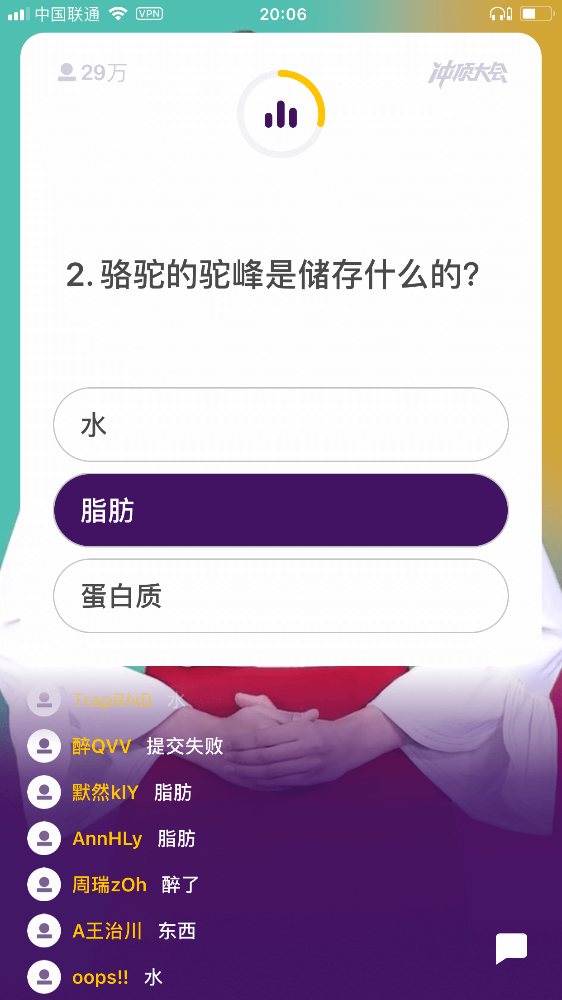
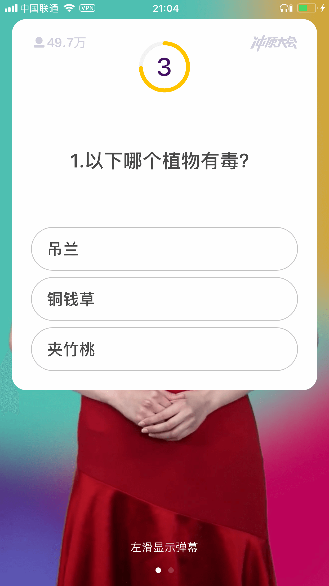

冲顶大会是最近很火的一款直播答题游戏，每天指定时间开放，12 道题，每题 3 个选项，10 秒作答，所有通关者分享奖金（每场奖金五万元或十万元），邀请好友可以获得复活资格。类似的游戏还有很多比如头条、映客、花椒直播等都推出了自己的答题游戏，这类模式的鼻祖是美国去年 8 月上线的 HQ Trivia。

看到这你可能会想，这尼玛不就是《开心辞典》搬到手机上了吗？这也能赚钱？没错，就是这样。

我这几天玩了几场，经过观察发现每场人数在三十万到五十万之间，现在互联网流量这么贵，花几万块钱就能在这么短时间带来这么多用户，相当值啊。罗振宇在跨年演讲时引用了德鲁克的一句话：“**对创新的最大赞美，莫过于人们说——这太显而易见了，为什么我就没有想到呢？**”，我想直播答题就是这样的现象级创新产品，而且它还有很多非常值得探索的盈利模式。



道高一尺，魔高一丈，我们看看有哪些可以 Hack 的方法。

题目出现再去搜索肯定是来不及的（除非你单身 40 年的手速），广大人民的作弊策略也是层出不穷。最简单的是一群人一起玩，可以利用网络延迟有多几秒的读题时间，遇到不会的每个人分开选，这样你只需要 3^12=531441 台手机即可通关。还可以使用两台设备，一个手机等主播读题，另一个利用百度的语音搜索也能查出答案，但是感觉这种速度要比较慢。

那么程序员应该如何玩呢？

首先用 [WDA](https://github.com/facebook/WebDriverAgent) 来获取屏幕截图。WDA 本是 Facebook 开发的一套 iOS 测试框架，前几天看见大家都用来做微信“跳一跳”的外挂，便特意去了解了一下，发现也能用在冲顶大会上。

之后 crop 出题目所在的位置（可能需要适配手机屏幕），然后调用开放的 OCR 接口读取出文字文本，最后调用搜索引擎，就可以达到之前 gif 图的效果。这套环境是 iOS + Mac，如果是安卓应该有更方便的方法。

其实最初的想法是希望搜索+选择答案全部自动化完成的，思路是 OCR 题目和候选答案，组成三个组合扔到百度或谷歌里搜索，然后哪个组合的结果出现次数最多就选择哪个。试了几个问题后发现并不是这样，比如上面图片的“骆驼的驼峰是存储什么的？”，可能多数人都会认为是水，因此出现的次数最多，其实是错误答案。

最后还有两个痛点：

1. 免费 OCR 接口调用次数有限，所以不能一直去截屏识别，只能等题目出现时运行程序。
2. 官方也很套路，有的问题是没法搜索的。。比如这种：



附上代码，不知大家有没有更好的想法：

```python
# python3
import wda
import io
import urllib.parse
import webbrowser
import requests
import time
import base64
from PIL import Image

c = wda.Client()
# 百度OCR API
api_key = ''
api_secret = ''
token = ''


while True:
    time.sleep(0.5)
    c.screenshot('1.png')
    im = Image.open("./1.png")
    region = im.crop((75, 315, 1167, 789)) # iPhone 7P
    imgByteArr = io.BytesIO()
    region.save(imgByteArr, format='PNG')
    image_data = imgByteArr.getvalue()
    base64_data = base64.b64encode(image_data)
    r = requests.post('https://aip.baidubce.com/rest/2.0/ocr/v1/general_basic',
                      params={'access_token': token}, data={'image': base64_data})
    result = ''
    for i in r.json()['words_result']:
        result += i['words']
    result = urllib.parse.quote(result)
    webbrowser.open('https://baidu.com/s?wd='+result)
    break
```

