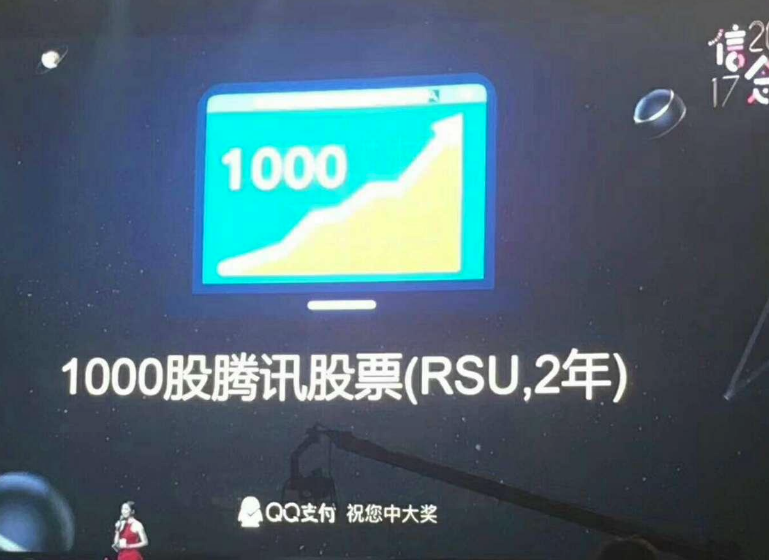

## Getting Paid

### 薪水的构成

1. 基本工资：主要受职位、等级、地理位置等影响，基本工资的调整主要受年度通货膨胀、内部审计、市场竞争力、晋升等因素的影响。
2. 奖金：签字费（通常有追回条件）、年度/季度奖金（通常是基于绩效的固定普调）、短期激励（不太常见）。
3. 股权：在 IT 行业内几乎所有等级和职位上都很常见，其他行业倾向于偏向高管。两种常见形式是股票期权和限制性股票。
4. 员工福利：税收福利、健康保险、退休保障、股票优惠等，在大型资金充裕的科技公司中，能够普遍地看到相当昂贵的津贴（食品、交通、健身等）。

### 什么是股权？

股权就是员工分享公司拥有权的价值，有许多种类之分，最简单的情况是，你的股份除以公司总股份。

- 上市公司（Public Company）：上市公司往往试图发展更大，对其财务结果和内容的公开透明有严格的规定，股票和股票期权的市场价格极其透明。
- 私有公司（Private Company）：大多数公司都是私有的，有多种股票类别，通常当公司是私人的时候，你不能出售你的股票。

### 股票期权与限制性股票

[股票期权](http://wiki.mbalib.com/wiki/股票期权)就是公司给你在一定的期限内按照某个既定的价格购买一定公司股票的权利，你可以在公司上市后卖掉**赚差价**，收益为（卖出价格-行权价） \* 股票数（行权价可以理解为买入价），如果公司股票一直下跌低于行权价，那就一毛钱都赚不到。

[限制性股票（RSU）](http://wiki.mbalib.com/wiki/限制性股票)是实实在在的股票，收益是卖出价格\*卖出股票数，只有在股票价格是 0 的时候才会一毛钱都赚不到。

 

图为腾讯 2017 年圣诞晚会抽奖

二者通常都是逐年实现的，比如第一年给 20%，第二年 50%，第三年 40%。很显然，限制性股票的价值更高，所以公司通常会给期权而不是限制性股票。

### 你的选择

这里有四个真实的 Offer（2017 年 8 月）：

|      |                   公司 A                   |        公司 B        |          公司 C          |          公司 D           |
| :--- | :--------------------------------------: | :----------------: | :--------------------: | :---------------------: |
| 规模/人 |                  10000+                  |       1000+        |           30           |         100000+         |
| 市值   |                超过 2000 亿                 |      超过 20 亿       | A 轮融资 1000 万，估值 5000 万 |        超过 2000 亿        |
| 职位   |                  软件工程师                   |       软件工程师        |         软件工程师          |          银行分析员          |
| 基本工资 |                   115k                   |        105k        |          89k           |           85k           |
| 签字费  |                   25k                    |        10k         |           3k           |           5k            |
| 年终奖  |                   10%                    |         无          |           无            |       60k（每年多20k）       |
| 股票   |           当前价值 200k 的 RSU（四年）            |    0.01%的期权（四年）    |      0.5% 的期权（四年）      |            无            |
| 员工福利 | 多的数不过来，50%的 [401(k)](https://baike.baidu.com/item/401%28k%29/6936282?fr=aladdin) | 免费食物，许多津贴，无 401(k) |  基本健康保险，401(k)，停车费交通费  | 较高的理财收益，没什么津贴，相当多的飞行公里数 |

思考这四个 offer，如果以一年为标准，那么看起来公司 A 是最值得的，因为它的基本工资很高；如果是五年呢，你会发现公司 D 更有价值，因为它的年终奖很给力。

那么从长期来看，驱动职场价值的因素是什么呢？

- 股份：在硅谷，拥有股份通常会有意外的惊喜
- 职业：也就是你的工作内容，都是技术岗位也有非常多的区分
- 公司的成功
- 多次加入中等规模超快速增长的公司会得到显著的好处
- 你可能想过几百种成功的方法，但也要吸取企业失败的教训

### 钱并不能决定一切

首先你要考虑公司未来市值的增长空间，这样你的股份才有价值；然后需要明白，公司的成功与否并不一定会影响个人，但个人的技术提升可能转瞬即逝，因此持续提升自己永远是最重要的；最后，学会沟通永远是职场最重要的元素之一，大公司在薪酬公平方面做得要比小公司更专业，因此要敢于真诚而坚定地跟经理讨论薪酬的问题。

## Spend Less Than You Make

### 收入与支出

不要花超过赚的钱是个人理财的终极秘密，别买你买不起的东西，不管你有多少钱，这条定律都非常重要。

### 储蓄率：应该存多少？

美国个人储蓄率在 2017 年 8 月是 3.6% 不要花费在没有未来收入的事情上。比如房子是资产，它可以带来源源不断的收入；而购买汽车则相当于负债。

房子是一种强制储蓄，截至 2017 年，63.7%的美国人都是房主（拥有自己名下的房子），当你每个月还房贷时，慢慢就会还清债务，留下资产，这提高了净值，就像储蓄一样。因此每月本金支付的强制功能可以有效地引导未来（几十年）里用房子创造可观的价值。

理财的目标：理想收益率 10%~15% 如何实现呢？首先要减少花费，也就是把尽量多的钱去存起来，让闲钱像工人一样继续帮你赚钱，而不是躺在兜里睡大觉。第二要增加资本池，因为短期都是有风险的，定投会更加安全。

自动化的好处：先支付自己的费用，然后建立预算，计算储蓄，自动取回。当薪水增加时尽量省下那个百分比，没有到手的钱就不太可能被花掉，这样无形中渐渐增加了自己的储蓄率。

### 收益表

收益表是一个财务报表，报告一个公司在特定期间的财务表现。个人也可以通过收益表来回顾一段时间的收入、支出和储蓄等情况。如果所有收入和开销都坚持使用软件来记账的话，那么很多软件都可以自动生成这种统计的图表。

收益表需要每个季度、每年定期检查和分析，改变和完善生活习惯，使用自动化的流程提高效率，减小出错的空间，并且努力持续维护它。

### 预算：钱都去哪了？

预算就是支出的分类，其实现在有很多记账的软件，使用它们可以追踪和分析自己的消费情况。同时需要在一定的上下文内（比如相同经济条件），把它和同学、同事对比，分析消费是否都是有价值的。

最后，一定要坚信存储是有效果的，因为很多比你赚的少的人都在努力省钱，也有很多比你赚得多的人正在破产。

事实已经证明，制定预算的行为减少了人们的花费。如果你已经超出了预算，不要感到惊讶，你需要一个平衡收入和开支的缓冲区。

