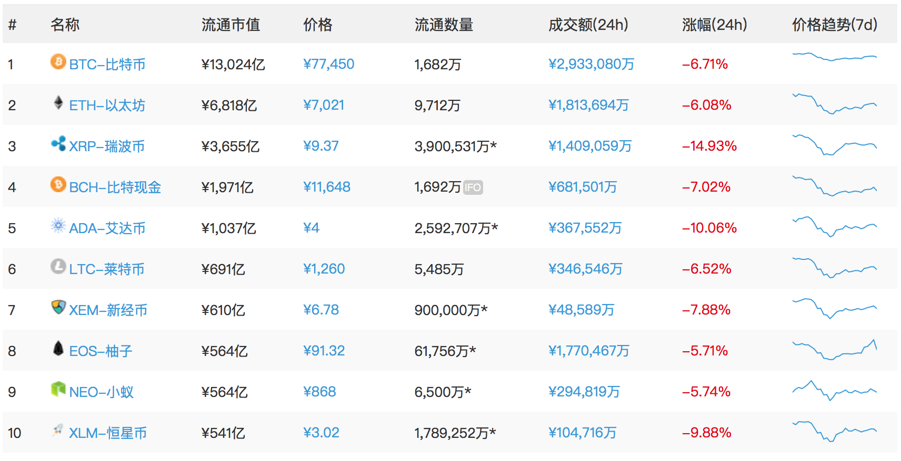
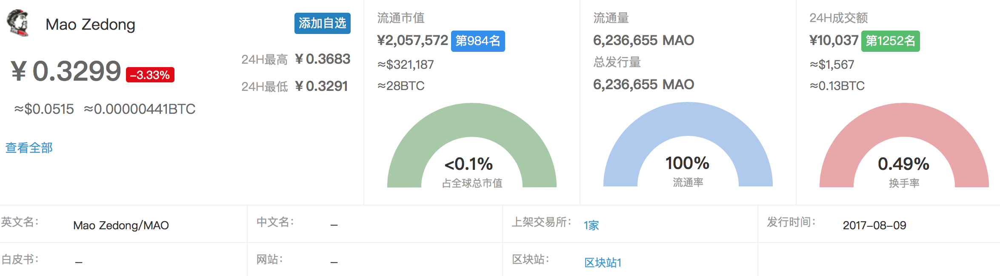
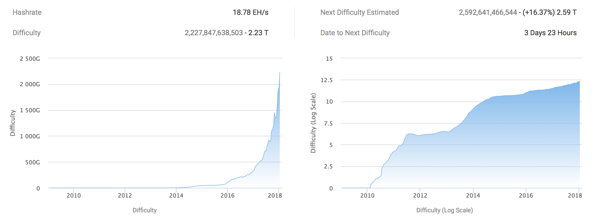
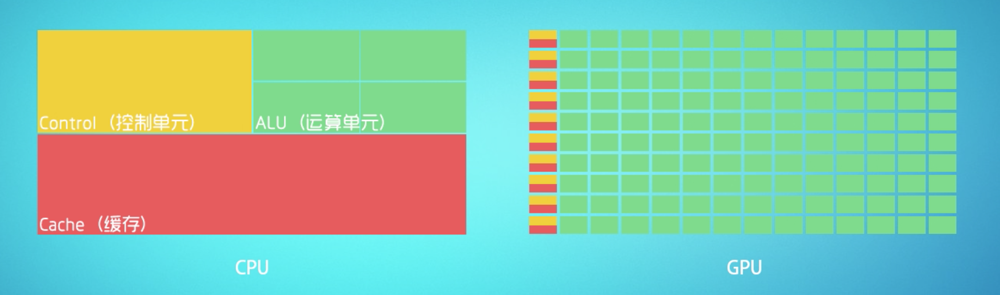
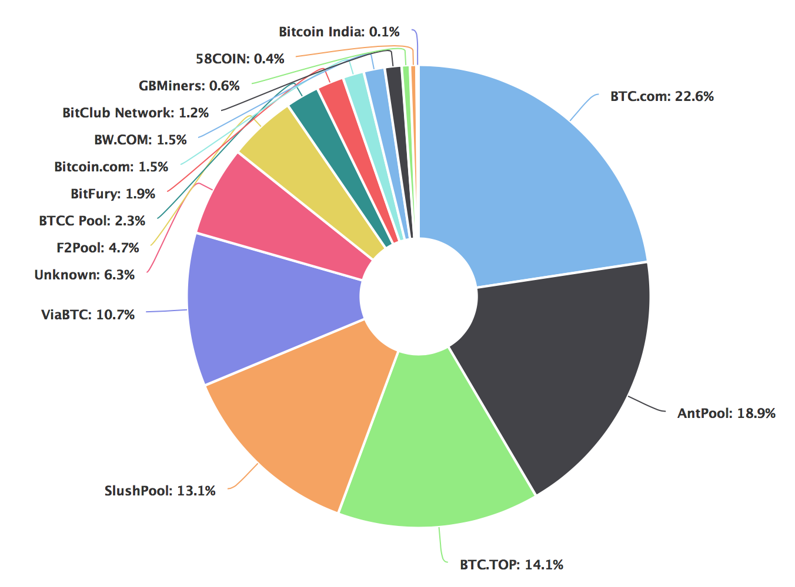
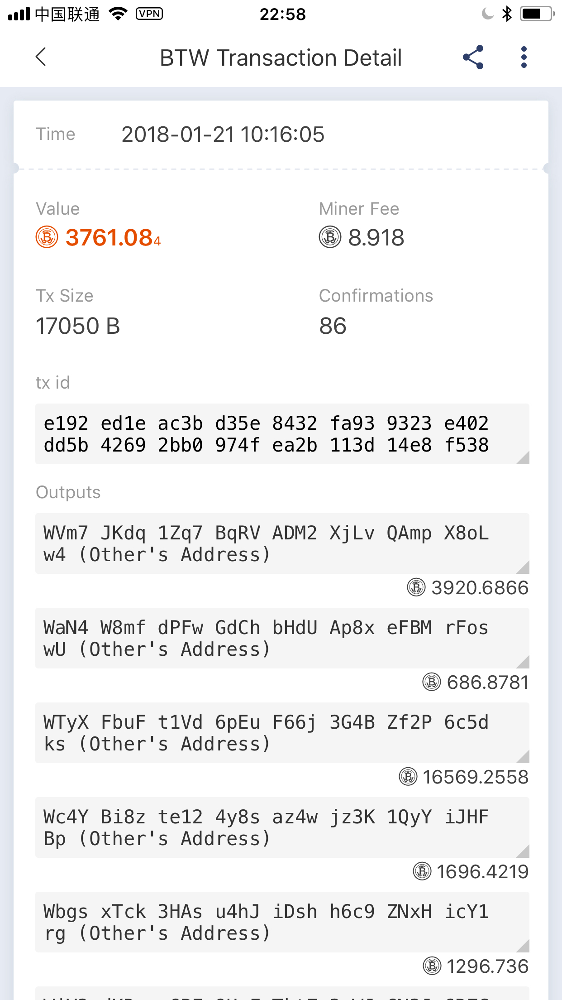

以比特币为代表的数字货币作为区块链技术的重要应用，正在慢慢进入人们的视野，拥有自己的数字资产也是一件很酷的事情，如果你不想买，那么最好的获取方法就是挖矿。

挖矿之前，我需要作几个简单的说明，以澄清潜在的误区：

首先，是不是数字货币只有比特币呢？

答案显然是否定的。数字货币行情分析网站[非小号](https://www.feixiaohao.com)目前共收录了 1700+ 种数字货币，其中市值前十名的为（2018 年 1 月 21 日）：



除比特币之外的数字货币一般被称为“山寨币”（altcoin)。这个词并不是一个贬义词，因为在山寨币中有很多优秀的项目比如以太坊（ETH）、EOS 等等，但多数山寨币仍是空气币这个现象确实是存在的，所以不少人制作了 [SB 币](http://www.stupidcoin.cn)、[懵币](http://www.mengbi.org)等网站调侃。



第二个误区是，“比特币这么贵了，我一个都买不起呀？”

实际上，比特币最小单位并不是 1，而是“聪”，没错，就是中本聪的“聪”。1 BTC = 1 亿聪，也就是说最小单位是十的负八次方。但是人们习惯了货币的整数交易，对小数点后这么多零有天生的认知障碍，因此很多人认为这是影响比特币在现实世界中流通的重要原因之一。

最后，我们并不是要直接挖比特币（再看一眼标题，还真没说挖比特币！！），而是挖山寨币然后换成比特币，最后也可以换成法币。

为什么不直接挖比特币呢？



这里有一张比特币挖矿的[难度变化图](https://btc.com/stats/diff)，显示其呈指数级上涨。也就是说在机器配置不变的情况下，你的 BTC 产出是越来越少的，同时由于 BTC 的设计机制，每个区块产出的 BTC 也是在不断减少的（当然 BTC 本身也是在不断增值）。作为个人玩家娱乐挖矿的话，山寨币是一个较好的选择。如果把挖矿当做投资的话，还是推荐 BTC、ETH 这种主流的货币，也可以参考 [whattomine](https://whattomine.com/) 的收益估算。

## 挖矿算法

目前的挖矿机理都是基于 PoW（proof-of-work, 工作量证明）的，它通过大量简单的重复运算产出一个符合要求的结果，并且这个结果很容易验证。

举个例子，为了通过考试不挂科，你需要不断地大量练习，才能解出一道题，然而对于阅卷而言只需和标准答案对比一下就完了，几乎不需要成本。PoW 的技术原理主要通过 hash 实现，这里先不讨论。

## 挖矿设备

挖矿设备主要经历了从 CPU -> GPU -> FPGA -> ASIC 的变化，挖矿效率也是越来越强大。

与 GPU 相比，CPU 包含多数（对于挖矿计算而言）无用的控制单元等结构，因此性价比很低。这就好比让两个大学教授和 100 个小学生一起计算一些 10 以内的加减法，显然小学生们计算的更快，教授就是大材小用了。

FPGA 的芯片生产困难，因此生存时间很短。在将 FPGA 中不需要的逻辑实现删掉后， ASIC 矿机问世。

ASIC 矿机（也就是目前我们所说的矿机）是为挖矿量身定制的，因此挖矿速度非常快（价格也比较高），除了挖矿什么都做不了。一旦遇上“矿难”，那你面对的就是一堆废铁，而显卡至少还有其他用处。



## 钱包

挖矿前需要准备一个钱包，存放自己的数字资产。这里推荐使用[比特派](http://bitpie.com)，它支持的币种比较多，你也可以选择其他钱包，但无论如何一定要保存好私钥，这是验证使用者身份的唯一凭证。

除此之外你也可以选择使用交易所的充值地址，这样挖到的币直接被转入到交易所中，可以随时卖了它，否则你需要先从钱包转入交易所，这个过程会收取矿工费。

## 矿池

加入矿池相当于选择组队挖矿，因为一个人可能很难挖到一个币，但是在矿池中就可以按照你的算力占全矿池的算力比例来给你分配收益。这就好比一个人买彩票几乎没啥希望，但是如果规定一亿个人一起买，中奖的平分的话，这样收益就稳定多了。当然，矿池会收取一定的费用。

我们在 <https://blockchain.info/pools> 可以看到比特币全球矿池的算力分布。其中最大的矿池 btc.com 只支持比特币和比特币现金（BCH）两个币种，为了能够挖到更小众的山寨币，我们可以选择其他矿池。



接下来我用两个矿池来挖两个币种，并分别使用**开源**和**闭源**挖矿软件。

## [蜜蜂矿池](http://www.beepool.org) —— [HSR](https://www.feixiaohao.com/currencies/hshare/)

蜜蜂矿池支持三个 GPU 挖矿币种，以 HSR 为例进入 <http://hcash.beepool.org> 中，这里有一份矿池的教程，我们还需要一个挖矿软件，这里我们使用开源挖矿软件 [ccminer](https://github.com/tpruvot/ccminer)。

首先默认你已经安装好了显卡驱动和 CUDA。

以 ubuntu 为例，先安装依赖：

```bash
sudo apt-get install libcurl4-openssl-dev libssl-dev libjansson-dev automake autotools-dev build-essential
```
切换到 gcc/g++ 5 (CUDA 的要求)，并 clone 仓库：
```bash
sudo apt-get install gcc-5 g++-5
sudo update-alternatives --install /usr/bin/gcc gcc /usr/bin/gcc-5 1
git clone https://github.com/tpruvot/ccminer
```

在开始编译前，你需要检查 `nvcc_ARCH` 以确保它和你的显卡型号是兼容的：

在 [wiki](https://github.com/tpruvot/ccminer/wiki/nvcc_ARCH-=--gencode=arch=compute_20,code=%22sm_21,compute_20%22) 中找到显卡对应 Compatibility 和与之对应的 `nvcc_ARCH`，然后按照说明修改 `Makefile.am`，最后编译并运行：

```bash
./build.sh
./ccminer --version
./ccminer -a hsr -o stratum+tcp://hcash-pool.beepool.org:9509 -u HCHSsFEuYqkGsyJZTDfetomyPb8AYkCNwB.livc -p x -d 0,2,3
```

其中，

- -a 为算法，这里对应的是 hsr，也就是我们要挖的
- -o 为矿池服务器地址
- -u 为你的钱包地址，你需要把这个地址替换成你自己的（hsr）地址，其中 livc 为矿工名字
- -p 密码，默认即可
- -d 指定 GPU 设备，默认全部

这时你的矿工已经开始工作了，你可以在 <http://hcash.beepool.org/miner/你的hsr地址> 查到实时的状态和收益。更多细节可以参考 ccminer 的 [README](https://github.com/tpruvot/ccminer/blob/windows/README.txt) 和 [INSTALL](https://github.com/tpruvot/ccminer/blob/linux/INSTALL)。

## [UUPool](http://uupool.cn) —— [BTW](https://www.feixiaohao.com/currencies/bitcoinworld/)

BTW 是 BTC 最近分叉的一个币，因此挖的人比较少。我们可以按照矿池的教程（<http://uupool.cn/course/btw>）直接下载挖矿软件。

以 N 卡为例，矿池提供的 EWBF's Zcash CUDA miner 是一个闭源挖矿软件，其项目主页发布在 [bitcointalk](https://bitcointalk.org/index.php?topic=1707546.msg17108283#msg17108283)。可见它实际上是一个 Zcash([ZEC](https://www.feixiaohao.com/currencies/zcash/))的挖矿软件，但因为 BTW 和 ZEC 的加密算法完全一致，我们可以直接拿来用。

编辑 miner.cfg 配置文件：

```bash
[server]
server btw.uupool.cn
port   3600
user   WY6MG5aAubs7E3xsjErgYh3ggAzSkow2QH(你的 BTW 地址)
pass   x
```

然后把下面两个 additional server 删掉即可，这是防止一个矿池连接出错保证连接到备用矿池上，默认的两个备用矿池应该是作者的钱包地址。

最后运行程序，

```bash
./miner --config miner.cfg
```

在 <http://uupool.cn/btw/你的btw地址> 上可以查到实时的状态和收益。

值得一提的是，闭源软件由于作者的优化可能带来更多的收益，但软件作者也会收取一定的 dev fee， EWBF's Zcash CUDA miner 默认收取开发者费用 2%，当然这个是可选的，你也可以通过 `—fee ` 来调控比例甚至拒绝支付这笔费用，也可以通过一些方法 hack 掉开发者费用，当然我并不推荐这么做，因为你只是损失了 1% 或 2% 的收益，而软件的作者损失的是全部的收益。

挖矿部分到此结束，每天矿池会给你的钱包中转入收益，比如：



今天我收到了 3761 个 BTW，在 [coinegg](http://www.coinegg.com/user/register?inv=104eb6) 上目前是三毛钱一个，那我昨天的收益就是 3761*0.3 = 1128 元！！哈哈，其实对于 BTW 还并不能这么算，因为 BTW 目前只上了这一个交易所，而且还没有开放充值，也就是有大量的像我一样的 BTW 矿工无法将 BTW 转入到交易所卖掉，所以当开放充值时一定会被严重砸盘的。

对于 HSR，可以将它转入到交易所换成 BTC（类似于股票交易），再通过场外交易卖成人民币。有人问为什么不直接卖成 RMB 呢？因为现在的交易所都是以 BTC 为单位的币币交易，这样就可以跟法币撇清关系，或者你也可以直接找人进行点对点的交易，这样风险比较大。

币币交易所推荐[币安](https://www.binance.com/?ref=11592137)和[火币](https://www.huobi.pro/?inviter_id=11129060)，币安是世界交易量第一的交易所，上面的币都比较靠谱，而火币自带法币交易，方便变现。这两个都是中国人搞的，减少潜在的风险。

最后，不要指着自己的几块卡能挖出多少钱来，如果自己娱乐的话，找几个看好的币挖着玩玩，几年后升值了也许能赚一点，如果将挖矿视为投资的话，你需要做充分的调研：对比不同的矿机、不同的挖矿软件、不同的矿池、选择最有发展前景的币种，这样才能获取最大的收益。

