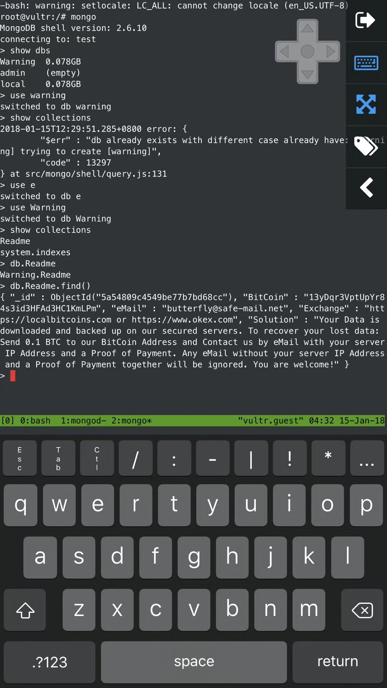

最近写的小工具 [CryptoHub](https://livc.io/blog/200) 中使用了 MongoDB，也是第一次用这种数据库。后来发现 VPS CPU 经常飙升到 100% 以上，然后上面的所有程序都挂了，必须手动重启。重启后发现 MongoDB 中数据全部丢失，多了一个 Warning 数据库，打开一看：



后来上网一搜才知道，MongoDB 默认是不开认证的，参考 [从 MONGODB “赎金事件” 看安全问题](https://coolshell.cn/articles/17607.html)，而且这个事情从 2017 年初就开始出现了，所幸我保存了所有 insert 语句的日志，恢复起来也比较容易。

由于比特币账本全部透明，我们可以根据黑客的地址查询到他的交易记录：<https://blockchain.info/address/13yDqr3VptUpYr84s3id3HFAd3HC1KmLPm>，结论就是他没有收到过任何比特币。。。还有一个可能是他对每个被攻击者留下了不同的钱包地址。

为 MongoDB 提供用户认证的方法很简单：

1. `mongod` 启动服务。

2. `mongo` 进入 MongoDB，默认会进入 test 数据库。

3. ```bash
   > use admin # 切换到admin数据库
   switched to db admin
   > db.addUser("livc", "pass") # 添加管理员用户
   WARNING: The 'addUser' shell helper is DEPRECATED. Please use 'createUser' instead
   Successfully added user: { "user" : "livc", "roles" : [ "root" ] }
   > db.system.users.find(); # 查询
   { "_id" : "admin.livc", "user" : "livc", "db" : "admin", "credentials" : { "MONGODB-CR" : "9efd6764037f18abe15260de80f003a5" }, "roles" : [ { "role" : "root", "db" : "admin" } ] }
   ```

4. ` mongod —auth` 以认证模式重启 MongoDB，重新进入 `mongo`。

5. ```bash
   > use admin
   switched to db admin
   > db.auth("livc", "pass") # 进行授权
   ```

之后即可正常操作数据库。