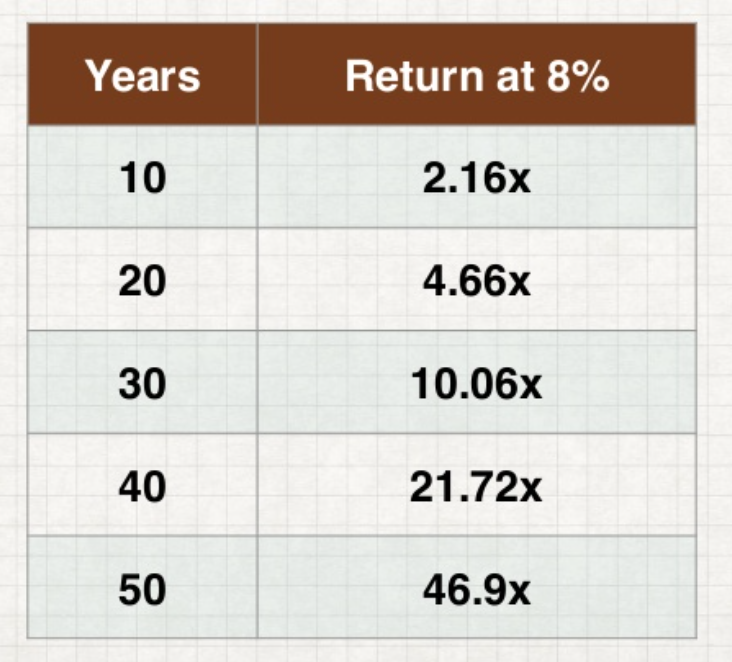

本文是这个公开课系列的最后一篇，前两篇在：

- [斯坦福 CS007：写给工程师的理财指南（一）——行为经济学](https://livc.io/blog/201)
- [斯坦福 CS007：写给工程师的理财指南（二）](https://livc.io/blog/205)

## Know Your Worth

### 资产流动性

### 流通性

如何在需要时快速获得现金？市场流动性指市场允许资产以稳定的价格买卖。资产流动性是衡量个人或公司能用其现有的流动资产满足其财务义务的程度。不要低估流动性的价值，资产的流通性是投资的力量之源。

流通性与收益率呈典型的**负相关**，比如现金的流动性很好而私募股票的流动性很差。流动性并不等于安全性，一张五年的 CD 很安全但是流动性很差，特斯拉的股票流动性很好，但是很容易蒸发。

### 应急资金

美联储在 2015 报告说，47% 的美国人没有足够的储蓄来支付 400 美元的紧急开支。流动性意味着当你需要资金时就可以获得资金。应急资金可以在短期内保护你的长期资产或计划，以免出意外。应急资金通常建议至少有 3 个月的生活费用。

不要把应急资金放在投资上，它是一种缓冲和保险，而不是资产，并且不到万不得已的时候不要使用它。

### 资产与负债

资产是任何具有经济价值的资源，比如投资于现金、债券、股票等的金融资产和房地产、收藏品、商品等的固定资产。除此之外，你的技能和能力是你最大的资产，这种“无形的资产”是最好的投资。

负债是一种财务义务，通常是债务，如房屋贷款、汽车贷款、学生贷款、信用卡、税务责任等。良好的**信用评分**会对大多数贷款的资格至关重要。

债务是坏事吗？[MM 模型](http://wiki.mbalib.com/wiki/MM模型)认为公司市值由营收能力和风险资产决定，而不是资本结构的组成（是否负债）。[权衡理论](http://wiki.mbalib.com/wiki/权衡理论) 认为存在企业的最优资本结构。

通过绘制资产负债表来知道你的净资产，这对评估个人资产也很有帮助。

## All About Debt

### 复利

[复利](http://wiki.mbalib.com/wiki/复利)就是复合利息，它的利息要并入本金中重复计息，俗称的“利滚利”。复利几乎是所有长期投资的关键，因为这种指数的函数每个时间段的收益都建立在前一个周期之上，因此尽早启动复利的投资会很有好处。但它的初期回报率比较小，所以关键的是要坚持下去。

72 公式：翻倍所需年数 = 72/年利润百分比

也就是说如果年利润是 12% 的话，那么你的钱在 72/12=6 年后就会翻倍。72 公式也可以用于计算通货膨胀，也就是说如果通货膨胀率是 8% 的话，那么在 72/8=9 年后，你手中的等额钱的价值就会变为一半。当然，我们前面说的是利润的复利，如果是债务也同样有效。

**年度百分率**(Annual Percentage Rate,APR)是指复利计息按一年一次来计算的利率(因此不包含复利）。它是衡量预期投资回报的标准方法，因为会有各种各样的收费方法和利率结构。而**存款年收益**(Annual Percentage Yields, APY)是包含复利的。

> 例如，假设你以APR 5%存了10000元，并且利息只有一年，那么一年后你将得到500元利息。
>
> 另一方面，假设利息是按月支付的。这就意味着，5%的APR将被分成12期，0.42%每期。第一个月之后你将收到10042元，第二个月时，0.42%的利息将会以10042为基数计算，以此类推。
>
> 由此，虽然APR是5%，但实际上1年后，你受到了512元。这就意味着APY是5.12%。
>
> —— 百度百科

### 债务类型

- 学生贷款：很多学校可以申请毕业后几年内再交学费，还有一些 P2P 的校园网贷也差不多是这种？不过非常有风险。美国的学生贷款负债有 1.4 万亿美元，而且这个数字还在增长。政府会对学生贷款的利率有所优惠或减免。（一般是 10 年、无担保）
- 抵押贷款：抵押的可能是房子或公司。在美国有 14.3 万亿美元的抵押贷款，而其中 10.3 万亿美元都是用来买房子。（一般是 30 年、有担保）
- 汽车贷款：1.2 万亿美元（截至 2017 年中期）（一般是 3-5 年、有担保）
- 信用卡：7840 亿美元（截至 2017 年第二季度，一般是 30 天，无担保）

### 信用评分

建立良好的信用评分对大多数贷款的资格至关重要，它是贷款资格和贷款利率的决定因素之一，许多产品和服务也利用它们来评估信用风险，此外还经常被用于身份验证。

### 贷款利率

分期偿还：借款人在还款期内分次偿还贷款，还款期结束，贷款全部还清。这种方法减少了借款人无法偿还所带来的风险。

## 财务计划及目标

什么是财务计划？

对当前和未来财政状况的综合评价，是一个决定一个人能否通过合适的金融资源管理实现人生目标的过程。它可能包括了对现金流和资产的分析，投资、退休、税收、风险、保险等方面的各种策略。

为什么需要？

1. 人们如果缺乏足够的储蓄动机，往往会花更多的钱 
2. 短期奖励与长期回报。
3. 需要时间来建立资产、明确财务计划增加成功的可能性 
4. 当涉及到一个人以上（夫妻/家庭）时，极为重要

什么是财务顾问？有权威的两个认证：CFP和CFA，理财规划师有助于人们避免行为错误，收费也十分高。但是，在未来10年内，可能会被个性化、数据驱动的自动化解决方案所影响。

财务目标是什么？财务目标是具有明确财务要求的资产、收入目标，比如还债、买车、买房、退休等。

## Additional Topics 

### Bitcoin

为什么比特币有趣？

1. 对于财务交易，比特币交易公开透明并且未经审查 
2. 无法强迫复制，也就是稀缺性 
3. 加密安全 

什么是 ICO ？将新发行的数字货币直接出售给投资者，参考 IPO，ICO 在2017年呈现出巨大的激增，存在着重大的监管问题，参考中国 94。

比特币是资产类别吗？尽管具有波动性，比特币回报率在任何风险调整措施下都是惊人的。迄今为止，比特币似乎与其他任何现有资产类别几乎完全不相关。但数字货币成为一个资产类别的可能性正在增加。

绝大多数金融业人士认为比特币是一个泡沫，许多科技界人士认为这是一个互联网扩张的机会。是否具有长期投资价值将验证数字货币是否是泡沫，然而有趣的是，比特币在 2013 年就被认为是一个泡沫。比特币的发展仅仅有几年，如此短的历史与其他金融资产相比，仅仅依靠财务数据无法预测未来 20 年内会发生什么。

### 衍生品

[金融衍生产品](http://wiki.mbalib.com/wiki/金融衍生产品)（Derivative)是指其价值依赖于[标的资产](http://wiki.mbalib.com/wiki/%E6%A0%87%E7%9A%84%E8%B5%84%E4%BA%A7)（[Underlying Asset](http://wiki.mbalib.com/wiki/Underlying_Asset)）价值变动的合约。2015 年金融衍生产品总价值为1.2万亿美元，超过 10 倍的全球 GDP 规模。

金融衍生产品的共同特征是保证金交易，即只要支付一定比例的保证金就可进行全额交易，因此具有[杠杆效应](http://wiki.mbalib.com/wiki/杠杆效应)。以期货为例，如果投资一万，杠杆 20 倍，就相当于拿着 20 万投，赚 10% 实际上就赚了 2 万，当然亏损的话也是同理，如果本金也亏损没了，那就是爆仓，因此建议不要轻易碰杠杆，一夜暴富确实有，一夜倾家荡产的更多，尤其是币市，因为数字货币已经相当于自带杠杆！

写在最后的话：读完这个系列后你需要做的事情——

1. 积极思考你的财务计划和决定。
2. 与你的朋友和家人讨论个人理财和相关话题。
3. 不要害怕做出决定，从错误中吸取教训。在你的钱和责任都不多时，开始学习个人财富管理。
4. 对任何快速实现财务成功（一夜暴富）的途径持要持怀疑态度。
5. 永远记住：好的投资是无聊的，要耐得住寂寞。

