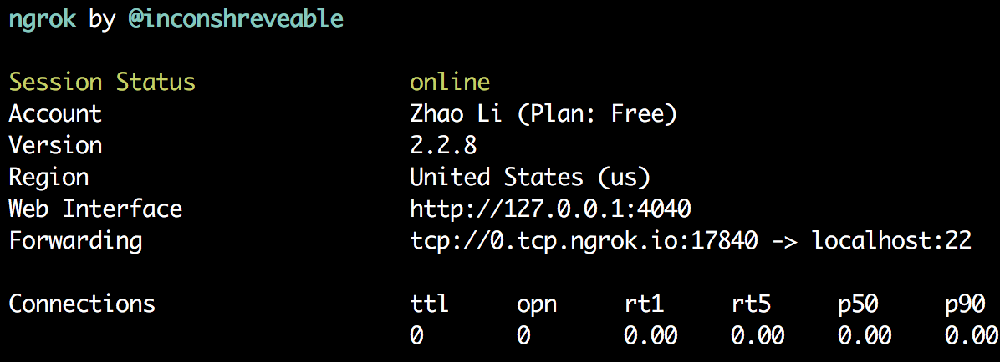

ngrok 可以帮助我们使用外网 ssh 到自己的电脑上，或者访问自己电脑上的 web 服务，本文以前者为例。

首先在其网站（<https://ngrok.com>）上下载二进制文件，并且注册账号得到 `authtoken`，然后进行认证：

```bash
unzip ngrok-stable-linux-amd64.zip
./ngrok authtoken abcd123456789
```

开启 ssh 端口

```bash
./ngrok tcp 22
```



这时在外网即可 ssh 访问本机：

```bash
ssh user@0.tcp.ngrok.io -p17840
```

开启 http(s) 服务也是类似操作：

```bash
./ngrok http 80
```

值得一提的是，免费版并不能自定义域名，因此每次启动时的端口都会改变。
