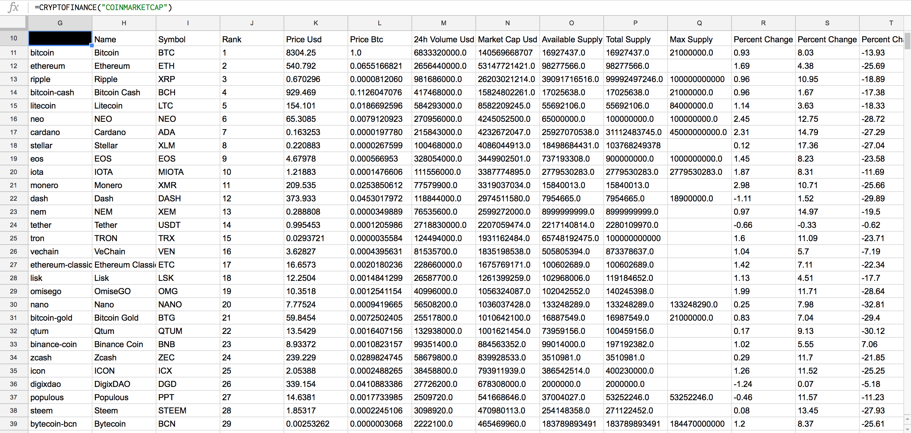
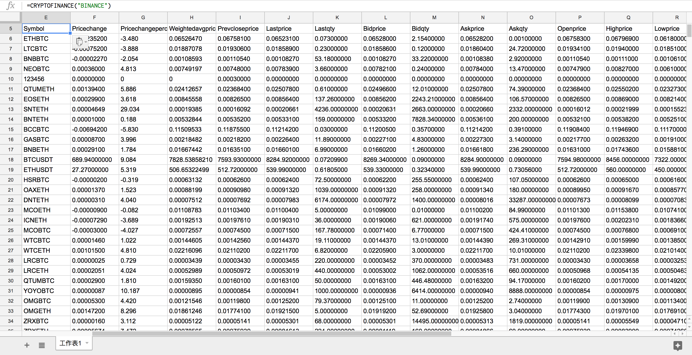

## 安装

点击 插件（add-ons）—获取插件—搜索“cryptofinance”——安装。

## 使用

### =CRYPTOFINANCE("COINMARKETCAP")

追踪 CoinMarketCap 上所有数字货币信息：

### =CRYPTOFINANCE("BINANCE")

获取交易所信息。

### =CRYPTOFINANCE("xxx/usd","price")

特定货币价格。

更多用法和 API 请参考 <https://jbuty.com/how-to-get-crypto-currencies-rates-and-more-in-google-sheet-1a57e571bc14>