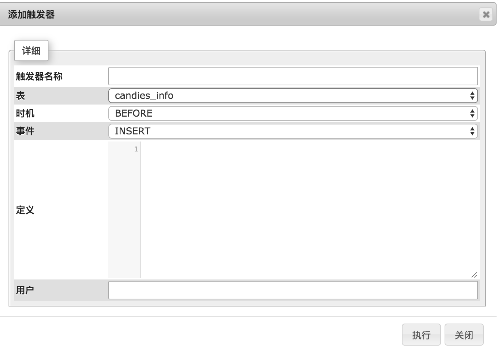

本文保存 Mysql 数据库变动的思路是把变动（前或后）的数据保存到一个新的表中。

假如原表名为 `tablename`，创建一个新表命名为 `history_table`，其中字段都跟 `tablename` 一致，创建一个触发器命名为 `trigger1`，在每次更新后都把新的数据插入到备份表中，这样就知道每次数据库做了哪些改动：

```bash
CREATE TRIGGER `trigger1`
AFTER UPDATE ON `tablename`
FOR EACH ROW
    INSERT INTO history_table                 
    VALUES
    (
        NEW.field1,
        NEW.field2
    );
```

把里面的 `field1`, `field2` 换成自己表中的字段即可。

也可以在 phpmyadmin 中直接创建 trigger，



直接在定义中写入

```bash
INSERT INTO history_table                 
VALUES
(
    NEW.field1,
    NEW.field2
);
```

即可。

可能会有的问题是，如果原表主键是数字，那么修改原表这一行一次以上的话，备份表就会出现两行相同的主键数据。我们可以在备份表中另建一个主键来解决。

## Reference

1. https://kahimyang.com/kauswagan/code-blogs/552/create-history-record-for-every-change-in-mysql-table-audit-trail-mysql-trigger