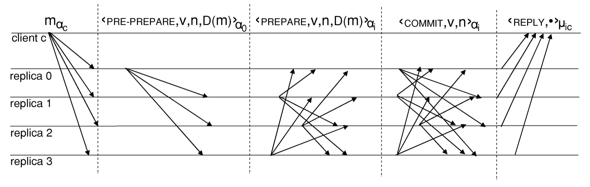
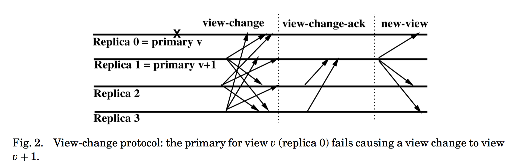

共识算法是分布式系统中一个很重要的概念，多个节点协同工作，如何就某个请求达成一致是一个很复杂的事。PBFT 全称 Practical Byzantine-Fault-Tolerant，是 BFT（拜占庭容错）算法的一种。

在分布式系统中主要有两种故障类型：一是系统的延迟、宕机等非人为错误，称为非拜占庭错误，另一种是人为的作恶比如恶意攻击，这在区块链系统中讨论较多，称为拜占庭式错误，PBFT 属于后者。关于拜占庭容错的理论可以看下其他文章，这篇文章主要描述算法。

PBFT 的相关论文比较多，<https://www.microsoft.com/en-us/research/publication/practical-byzantine-fault-tolerance-proactive-recovery/> 这篇比较容易理解，同时有很多开源的实现，<https://github.com/gdanezis/pybft> 比较完整，符号和 paper 中一致，就是没有注释，不是很容易完全看懂。

## Overview

客户端发送请求给副本（去执行一些操作），BFT 保证所有正常的副本以相同的顺序执行相同的操作，如果客户端收到来自 f+1个节点的相同的响应消息，则共识完成，执行请求；由于这 f+1 个中至少一个是正常的副本，因此可以保证结果是正确的，但是难处在于在一个分布式系统中，如何确保正常的副本以相同的顺序执行相同的请求。

PBFT 使用 primary-backup 和 quorum replication 技术去为请求排序。

### primary-backup

在一个 view 中，有一个副本是主节点（primary），其他副本是备份节点（backups）。主节点接收客户端的请求并给它安排一个可用的序号（sequence number）,然后发给备份节点。主节点可能坏掉，比如为不同的请求安排了相同的序号、停止安排序号、序号不连续等等。备份节点会检查序号，并且设置了超时机制以防主节点挂掉。如果主节点挂掉后，view 会切换并且选择新的主节点。

### quorum

quorum 有两个重要的属性：

- Intersection：任意两个 quorum 至少有一个公共的正确副本。
- Availability：总有一个没有出错副本的 quorum。

副本将信息写入 quorum 后得到 quorum certificate，这些证书是信息已经被可靠存储的证明。此外 weak certificates 代表至少 f+1 个不同的副本存储信息，这样能保证至少有一个正确的副本存储了信息。

副本的集合用 R 表示，{0,...,|R|-1}，|R|=3f+1，f 是最大故障节点数。

主节点为 p=v mod |R|，

其中 v 是视图号（view number），是连续增加的，这样保证主节点在{0,...,|R|-1}内。

定义集合 quorum 里至少有 2f+1 个副本。

## 客户端

客户端 c 通过广播 <REQUEST,o,t,c> 发送包括操作 o 的请求给副本，其中 t 是时间戳。

当请求最后达成共识后，副本会回复给客户端 <REPLY,v,t,c,i,r> 其中 v 是当前视图号，t 是对应请求的时间戳，i 是副本号， r 是请求操作的执行结果。

客户端收到来自 f+1 个不同副本（具有相同 t 和 r）的回复后（weak certificate），会接受结果 r。由于最多有 f 个副本是坏的，那么这就保证结果是有效的，称之为 reply certificate。

若客户端未在一定时间内收到 reply certificate，它会再次发送请求，如果请求已经被处理了，副本会再次发送回复，因此副本需要记住它对每一个客户端回复的上一个消息。如果主节点没有为请求安排合适的序号，它就会被其他节点怀疑坏掉，足够多时会造成主节点更换（view change）。

对于客户端数量带来的可扩展性，可以通过限制活跃客户端数量来解决。

## 示范

我们使用三段协议去自动广播请求给副本：pre-prepare，prepare，commit。下图是没有故障节点时的算法总览：

### pre-prepare

主节点 p （0 号副本）收到客户端请求 m (m=<REQUEST,o,t,c> )后，分配序号为 n，广播 pre-prepare 信息给备份节点，格式为 <PRE-PREPARE,v,n,D(m)>，其中 v 是视图号，D(m) 是 m 的 digest。

n 要在低水位 h 和高水位 H 之间，保证垃圾回收机制和防止出错的主节点随意选择序号。

如果其他备份节点已经收到了包含 v 和 n 但不同 digest 的PRE-PREPARE，那么它就不会接受（not accept）。

### prepare

备份节点进入 prepare 节点，向其他副本广播 <PREPARE,v,n,D(m),i>，同时会将 PRE-PREPARE 和 PREPARE 的信息写入日志。

每个副本收到 2f 个一致的 PREPARE后会得到 prepared certificate，证明了这个 quorum 一致同意视图 v 内 m 的序号为 n。

### commit

副本 i 广播 <COMMIT,v,n,i> 来宣布自己已经拥有了 prepared certificate，当副本收到 2f+1 个来自不同副本（包括自己）的 COMMIT 后（n, v 相同），获得 committed certificate。

每个副本按照客户端请求的顺序执行请求，然后回复客户端。

## 垃圾回收

已经执行过的请求的相关日志应该被删除，但是其中包含的 prepared certificate 可能在后面被使用，所以应该什么时候删除呢？

每个副本在执行请求后可以广播全网说可以删掉 log 了，但是每个请求后都发成本比较高，因此设计 checkpoint period K，每 K 个请求广播一次，这个 checkpoint 称为 stable checkpoint。

副本 i 到达 checkpoints 时向其他副本广播 <CHECKPOINT,n,d,i>，其中 n 是上一请求序号，d 是 digest，其他副本收到 2f+1 （包括自身）个 CHECKPOINT 消息后，会删掉所有序号小于等于 n 的 log 和之前的checkpoints。

但在实际的系统中，每个副本都不是同步的，所以高低水位限制了什么样的消息能够添加到 log 中。高水位 H=h+L，其中 L 是 log size，低水位 h 是上一个 stable checkpoint 的序号。高水位一般是 K 的倍数，而且比较小，比如 2 倍，因此如果有的副本执行的比较快的话，需要等一等其他副本，这个区间足够了。

## 视图切换

view change 协议主要发生在主节点故障时，新的 view 如何保持上一 view 的状态，以及如何处理未完成的请求。

### 数据结构

副本需要用两个集合 P 和 Q 记录之前 view 里的信息，系统正常时这两个集合是空的。

副本 i 的集合 P 存储了之前 view 中到达 prepared 状态的请求，数据结构为 <n,d,v> 意为副本 i 收集到 view v 中序号为 n，digest 为 d 的请求的 prepared certificate，并且副本 i 上的下一个 view 中就不能有相同序号的请求。

Q 存储了之前 view 中到达 pre-prepared 状态，<n,d,v> 意为 i 已经 pre-prepare 了一个请求并且在下一 view 中这个请求没有相同序号的 pre-prepare。

### View-Change Messages

下图展示了从 v 切换到 v+1 时的 view change 协议。当备份节点 i 怀疑视图 v 下的主节点作恶之后，它会切换到 v+1 中并且广播 <VIEW-CHANGE,v+1,C,P,Q,i>，其中 h 是副本 i 的最新 stable checkpoint，C 是每个 checkpoint <序号, digest> 的集合，P 和 Q 上上一节描述的。

### View-Change-Ack Messages

副本收集 VIEW-CHANGE 消息后发送 acknowledgments 以达成切换到 v+1 的共识，<VIEW-CHANGE-ACK,v+1,i,j,d> 其中 i 是发送者的标识，d 是acknowledged VIEW-CHANGE message 的 digest，j 是发送 VIEW-CHANGE 消息的副本。

接下来是 New-View Message Construction 和 New-View Message Processing，属于比较细节的处理，这里不再介绍。