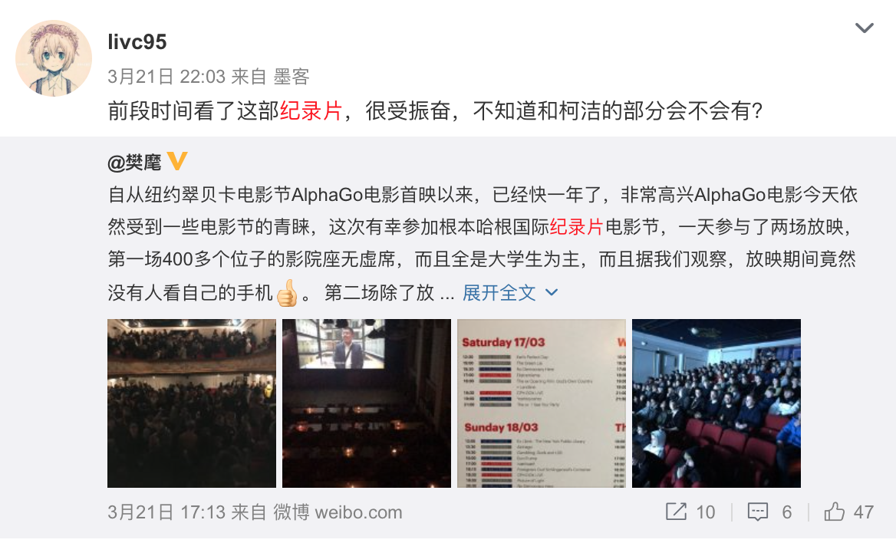
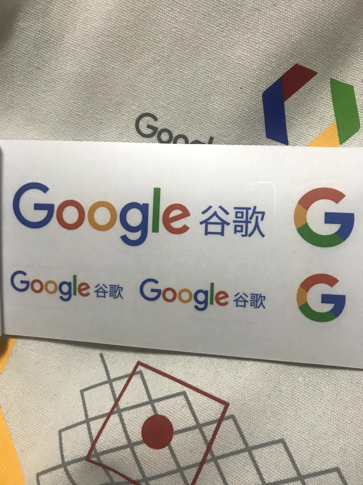
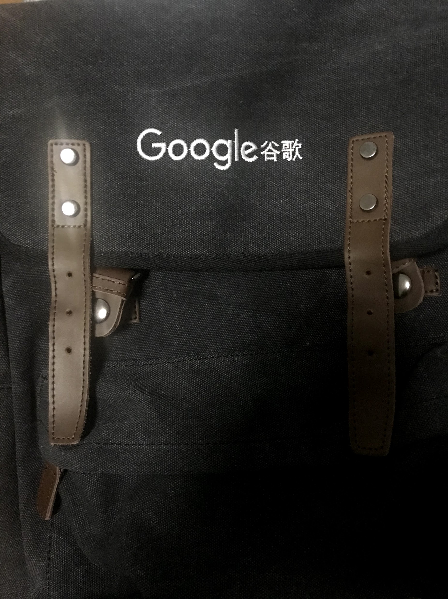
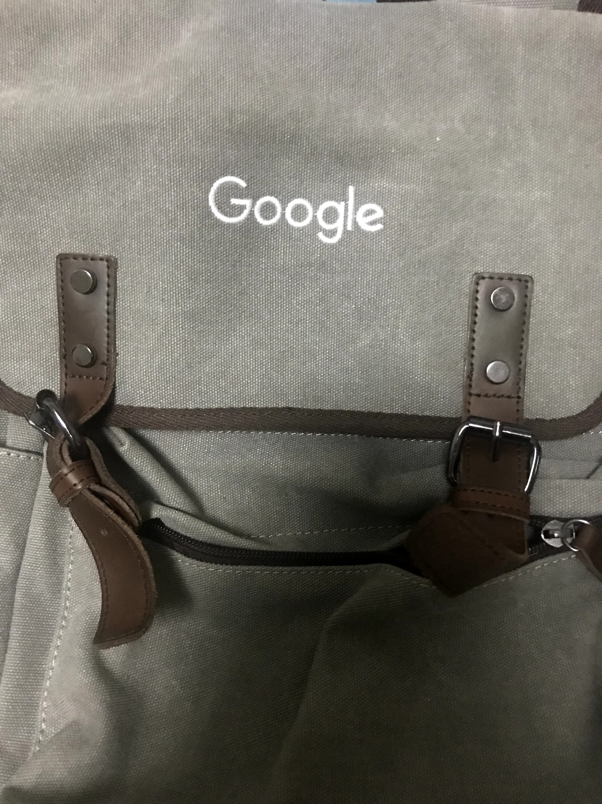

来到上海的第二年，也是第二次参加谷歌开发者大会（GDD）。在排队 checkin 时偶然望到一个人特别像樊麾，问了一下同行的目前在 Google 实习的学长，发现真的是他。不过心想为什么他和我们一起排队领 Guest 的 Badge 而不是 Googler 的呢？排了好久队，发现貌似大家都没有认出樊麾，checkin 后我主动去打招呼：

“你好，你是樊麾吗？”

“是我。”

“真的吗？”

“没错，是我，活的！”，说这句话时樊麾瞪大了眼睛……

之后简单聊了几句，我说我看过那部 AlphaGo，他问我是不是做 ML 的，我说目前在上海上学做 NLP 相关的，然后我就去会场了，他和朋友继续在大厅中聊天，期间还是没有人认出他。

见到樊麾时非常激动，我想主要来自于《AlphaGo》这部纪录片对我的影响。不知道是这部片拍的好，还是因为这个 project 真的让人振奋，我在看过之后感到异常兴奋和鼓舞，感慨人类的伟大智慧。而这部纪录片的主人公就是樊麾，一个非常有趣的科技男形象。

今年的 GDD 秩序不如去年，主会场比较小导致许多人只能在分会场看直播，产品体验区的展位也少了许多，当然小礼物也对应少了不少。午餐从去年的中西自助变成了盒饭，我的蔬菜里面还有一条虫子，我们都在开玩笑能不能拿这个虫子换一个 offer……

上午有一场 Demo Day 的活动，有一些 start-up 会进行路演。这个我原本很想去看的，但因为下午有课，时间来不及，就没有去看。中午又来了几个学长，有一位和我共同选了下午的密码学课，结果就是最后我俩都逃掉了。

我观察到一个非常有意思的现象：Google 在今年 GDD 的品牌宣传上不知是有意还是无意的强调了“谷歌”这两个汉字，比如说贴纸：

在我的印象中，去年的贴纸 Google 后面是没有中文汉字的，贴纸上的“谷歌”两个汉字让我觉得不是很酷，所以没有把它贴在电脑上。

另外可以对比一下今年送的书包和去年我在与李飞飞闭门会议上得到的书包，这两个包除了颜色，样式一模一样：

Google 可能真的要回到中国了，只是不知道它是否还记得那句经典的信条。
