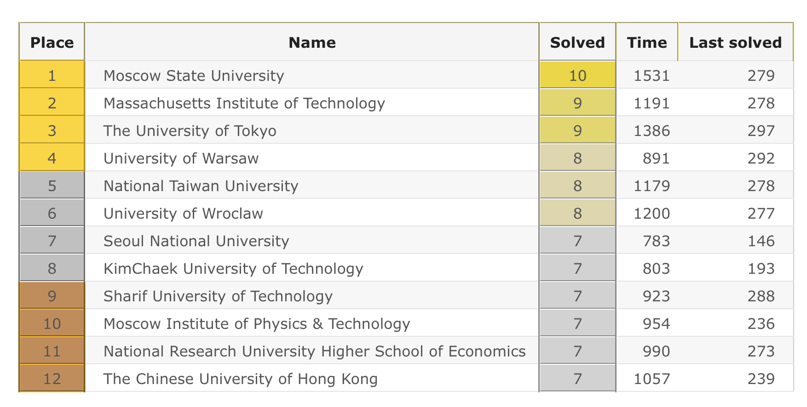
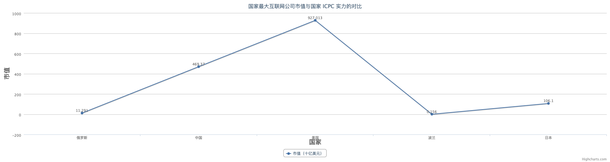
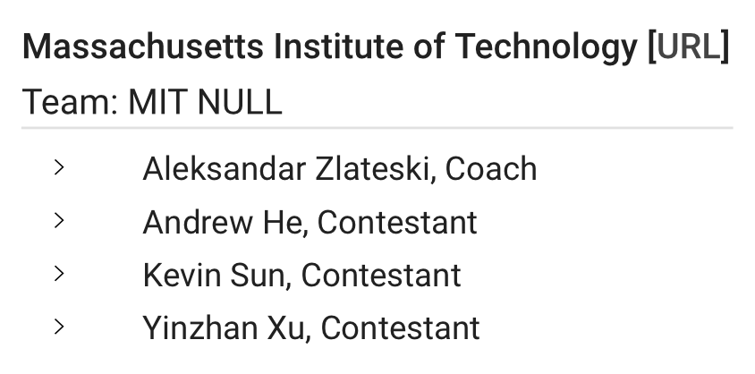
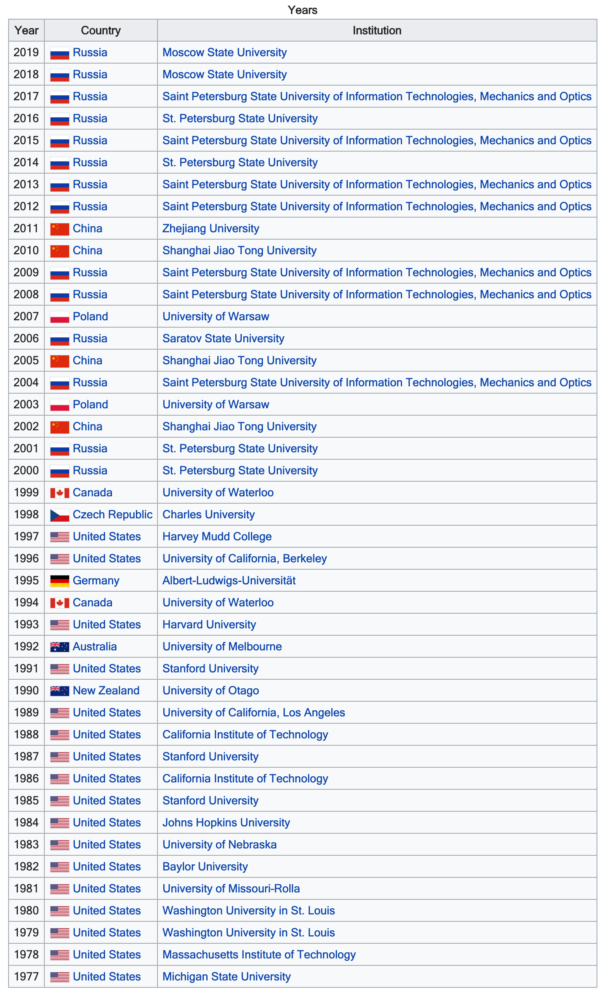

早起被朋友圈刷屏，原来 2019 年 ICPC 世界总决赛结束了，中国大陆高校近几年来首次没有获得任何奖牌。今年获得奖牌的高校排名如下：

由于 ICPC 的赞助商从 ACM 换成了 JetBrains，现在只称其为 ICPC，其实还有点不习惯，所幸没有叫 JB-ICPC。俄罗斯学校已经连续第八年夺得冠军，那么 ICPC，也就是大学生的程序设计水平和该国的互联网发展之间有什么关系呢？这是本文想讨论的。

为此，我将过去五年的 ACM 世界总决赛的最终排名做了一个简单的统计，每年会为前 12 名队伍颁发奖牌，金银铜各四支队伍。我将金牌算作 3 分，银牌 2 分，铜牌 1分，看看各个国家得分的总和，以代表该国**学生**的 ICPC **程序设计实力**（表中数字为该国高校在该年的排名）：

|          | 2019             | 2018               | 2017               |2016| 2015 | 总分 |
| :------: | :--------------: | :----------------: | :----------------: | :--: | :--: | :------: |
| 俄罗斯   | 1、10、11（5分） | 1、2、9、13（8分） | 1、4、5、10（9分） | 1、4、7、8、10（11分） |1、2、12（7分）| 40 |
| 中国 |                  | 3、7、8（7分）     | 6、7、8（6分）     | 2、12（4分） |4、5、9（6分）| 23 |
| 美国     | 2（3分）         | 10、11（2分）      |                    | 3、6（5分） |6、10（3分）| 13 |
| 波兰     | 4、6（5分）      |                    | 2（4分）           | 5、9（3分） || 12 |
| 日本     | 3（3分）         | 4（3分）           | 12（1分）          |      |3（3分）| 10 |
| 韩国     | 7（2分）         | 5（2分）           | 3、9（4分）        |      |11（1分）| 9 |

这样统计实际上是非常粗糙的，因为它没有考虑人口数量和移民等因素。除此之外，我排除了那些在这五年里只获得一个奖牌的国家和地区（比如港台、瑞典等）。

接下来，我调查了一下这些国家最大的互联网公司的市值，以此代表该国的**互联网科技实力**：

|  国家  |         公司         | 市值（USD） | 排名 |
| :----: | :------------------: | :---------: | :--: |
|  美国  |         苹果         |  927.013B   |  1   |
|  中国  |       阿里巴巴       |   469.37B   |  2   |
|  日本  |         软银         |  106.10 B   |  3   |
|  韩国  | NAVER（LINE 母公司） |   15.76 B   |  4   |
| 俄罗斯 |        Yandex        |   11.291B   |  5   |
|  波兰  |       Allegro        |   0.156B    |  6   |

将 X 轴视为程序设计实力的排名，Y 轴表示该国最大互联网公司的市值，可以绘制这样一幅图：

我们可以看到，在三个世界大国之间，**互联网实力越强的国家，程序设计能力反而更差。**由于中国从青少年开始就有很专业的程序设计训练，很多优秀的高中生都会被美国名校录取，因此很多美国高校队伍里有很多中国人，比如今年排名第二的 MIT：

其中 Yinzhan Xu 同学的 [IOI地址 ](http://stats.ioinformatics.org/people/5059) 显示为中国（这种大佬随便 Google 一下就能找到主页），说明在本科之前他还是在中国的。

因此除掉这个因素，美国的程序设计能力排名**可能**还会往后，而中国和俄罗斯之间由于差距巨大，很难赶超。遗憾的是这些都是感性的分析，无法严格地统计，但同样能够说明问题。

回到刚才的结论，为什么**互联网实力越强的国家，程序设计能力反而更差？**

在我看来， **互联网实力强的国家的大学生，想象力和创新能力更加丰富，对新技术更加充满热情；而互联网科技实力较低的国家的优秀大学生，因为环境的封闭，并没有更多的其他选择。**

作为一只退役选手，我深知每一位 ACMer 的坚持。很多出色的程序设计选手都是从小就开始训练，如果是刚上大学才学习编程的话，那更要付出巨大的努力。程序设计比赛的形式很简单，一页英文题目，但可能会做几天才想出最好的方法。于是，泡实验室成了家常便饭，挂科也很有可能。程序设计训练的强度和密度令人难以想象，这些取得成就的同学，都是在这上面花费了大量时间精力（和头发）的人。由于大学生涯的时间是有限的，自然难以分出精力去做其他的事情。

我们来看一看美国人在做什么。观察一下每年冠军学校所在的国家，除了近八年俄罗斯称霸之外，美国人自从 1997 年之后好像就蒸发了一样：

那么 1997 年夺冠之后，美国学生去做什么了？

翻开史书，这个时间正是互联网泡沫时期，无数的 dot-com 公司不断成立，尽管很多公司走向消亡，但仍然留下了很多改变世界的公司。比如美股科技五巨头 FAANG 中，亚马逊成立于 1995 年，Netflix 成立于 1997 年，Google 成立于 1998 年，乔布斯在 1997 年重返苹果，让苹果起死回生。因此我们有理由相信：**互联网的腾飞让美国大学生看到了太多的机会，去做与人交互、改变世界、颠覆认知的产品，可能比独自去写那些枯燥的算法代码更有趣。**

如果提到能够载入史册的中国和俄罗斯的学生创业者，好像仍然屈指可数。你可能会提到以太坊创始人 V 神，但 V 神虽然 1994 年在俄罗斯出生，但 1999 年就移民加拿大去了。

中国高校的全军覆没未必是件坏事。我们有理由推断**现在优秀的中国大学生，也能够有很多选择**。学术上，中国学生申请国外高水平学校竞争越来越激烈，很多经过良好训练的本科生都能够发表高质量的论文；商业上，随着国家对创新创业的鼓励，有专业技术背景的学生能够在资本市场上取得青睐，比如饿了么和 Teambition；技术上，摩尔定律推动着硬件革命，继而带来不断的风口：O2O、VR、AI、Blockchain…新技术的快速迭代吸引着年轻人的热情；职场上，利用寒暑假实习的同学大有人在，他们希望走出校园的象牙塔，看看工业界的人到底在做些什么……

程序设计只是一个选择，选择没有对错，只有适不适合与喜不喜欢。别人在做什么并不重要，重要的是我们在做自己想做的。

## References

- http://tradingview.com
- https://en.wikipedia.org/wiki/International_Collegiate_Programming_Contest
- https://icpc.baylor.edu/community/results-2016
- https://www.rbth.com/business/327647-most-valuable-internet-companies
- https://www.value.today
- http://alexa.chinaz.com/Country/index_PL.html
