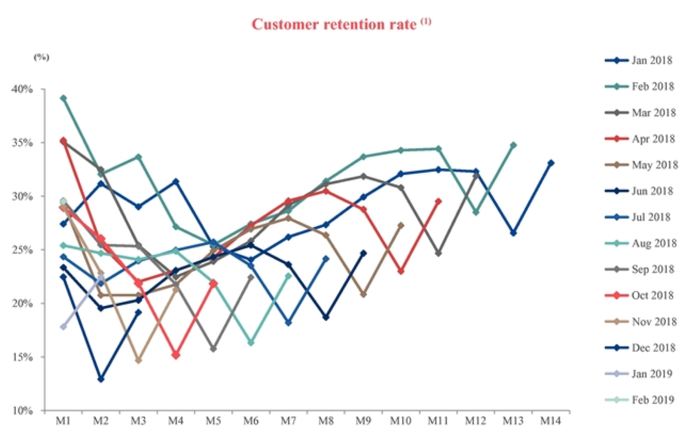

最近越来越觉得对于创业公司来说财务是多么重要，这些内容对于一般创业者来说很难主动学习到，只能在实践中探索，或者交给专家，比如 CFO。上市公司的招股书、财报等信息包含了很多公司运营和财务的数据，值得学习。

>We are offering 30,000,000 ADSs. Each ADS represents eight of our Class A ordinary shares, par value US$0.000002 per share.
Prior to this offering, there has been no public market for the ADSs or our shares. It is currently estimated that the initial public offering price per ADS will be between US\$15 and US\$17.

这个 15-17 美元是发行价区间没有疑问，那每股 0.000002 美元是什么意思？这个是因为开曼上市主体有个注册总股本，那个数字可能很大，跟公司的总股本不匹配，而且基于这个股本的每股价格自己定的。比如一家公司注册时开曼主体总股本是 5 亿股，每股 0.0001。但实际上总股本是 1 亿股，每股 7 美元。

> Each Class A ordinary share is entitled to one vote; and each Class B ordinary share is entitled to ten votes and is convertible into one Class A ordinary share at any time by the holder thereof.

AB 股的划分，用来调整投票权，美股中很常见，中国 A 股应该是不允许这种结构。B 类可以转成 A 类但 A 类不能转成 B 类。

> Cumulative transacting customers > 16.8mn

用户很大了。

> "item sold" refers to an item transacted on our mobile apps or through third-party platforms in a given period, regardless of whether the item was paid for or was merely ordered through our free product marketing initiative;

**regardless of whether the item was paid for or was merely ordered through our free product marketing initiative;** 从表述来看是下单没有支付的订单也算在销售量里了，不知道这样会不会有数据造假的可能性，也许是我多想了。。

> in 2018, 91.3% of new customers made their first purchase via our Luckin mobile app.

也就是说九成的注册用户都至少完成购买行为一次（毕竟新用户第一杯免费）。

这个图比较有意思，留存突然掉下去又突然涨上来，原来是受中国春节假期的影响。

其他的几个观察：

1. Luckin 最开始叫 Luck Coffee。
2. 招股书中 LK 始终强调自己是一个科技公司，但除了他自己可能没人这么觉得。。但它又不完全不是科技公司，毕竟有个 APP。
3. LK 自称使用机器学习算法动态调整价格，但实际上咖啡的售价是固定的，除了配送的起送价可能会随早晚高峰波动。
4. LK 几乎所有数据都非常好看，比如获客成本从 2018 年 Q1 的 103.5 元到 2019 年 Q1 的 16.9元、留存等等，显示出公司积极的态势，因此这时是最好的上市时机，也显示出了创始团队的经验。