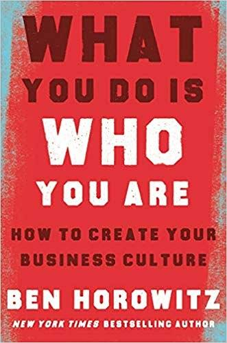
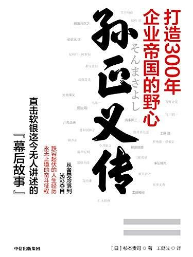

有意识地从历史经验中学习总结是很重要的一项技能。

疫情期间很多行业的公司遇到了很多问题，这种黑天鹅事件几乎没有人有处理经验，但我们是否可以参照下非典时期、埃博拉病毒时期时，那些公司是怎么做的？

阿里巴巴在非典时期进行了有效的应对，C2C 业务淘宝应运而生，这是一个非常经典的案例。疫情对餐饮服务业造成重创，但却利好在线教育、生鲜电商等行业，对于这些人来说疫情是上天的礼物，但疫情结束后能否保持优势显得特别重要。有句话很有意思，凭运气赚的钱一定会凭本事亏回去。

我认为死于疫情时期的公司不会多，因为黑天鹅事件对所有人的影响是同样的，但疫情结束后，谁在裸泳马上就看出来了，这段时期有没有有效的运营和管理，有没有优化和反思组织结构，有没有适当的调整战略，决定了你能否在疫情结束后活下去。同样的道理，短短的几个月已经培养了很多新的用户习惯，比如大家发现线上开会效率反而更高；小朋友习惯了放学后的网课；大爷大妈开始用 app 买菜；纯无线耳机会挂在耳朵上一天，却没有比较 casual 的产品能够提供有意思的新的交互；remote work 哪些需求未被满足；食堂提供的打包盒饭意外地完全解决了之前排队拥挤问题；MCN 开始组织医生直播，基于 LBS 的垂直线下场景不需要李佳琪，因为医生有一千万个病人他也看不过来，长尾的直播内容开始引起关注。这些都是疫情结束后的巨大机遇。

微软总裁兼首席法务官 Brad Smith 在 《工具，还是武器？》中讨论了科技进步和隐私、伦理等社会问题之间的关系。实际上在隐私保护、科技的监管等方面，微软做了很多努力来平衡与政府、用户之前的关系。比如说美国之前有某个法律条款说只要政府要求提取某个用户的数据，企业需要提供但要对这位用户保密。微软认为用户个人信息被调用时应该有知情权，便与政府沟通了很多。

当微软高管和硅谷其他科技巨头与白宫开会呼吁对人脸识别等高科技的立法和监管时，全场没有一人感兴趣，都希望回避这种“无关紧要”的话题。但实际上爱因斯坦早就在战争年代提醒世人注意，“要是人类组织能力的发展能够跟得上科技前进的脚步”，科技进步“早就可以使我们生活得愉快幸福且无忧无虑了”。相反，“这些辛苦赢得的大机器时代的成就掌握在我们这一代人手里，但却像把剃刀交给一个三岁小孩一样危险”。结果日内瓦会议以失败告终，在那个 10 年临近尾声的时候，这一失败已经蜕变为无法想象的全球灾难。 

爱因斯坦的震耳欲聋的警告揭示了当今科技发展的关键所在：在科技不断进步的同时，它所创造的未来能否被世界控制？导致战争的原因，往往就是人类跟不上创新的步伐，在新技术的管理上几乎无所作为，而且为时已晚。随着网络武器和人工智能等新兴技术越来越强大，我们这一代人将再次接受这一考验。

很多大佬鼓吹 AI 时代会让很多人失业，当我们再回看历史，真的是这样吗？汽车的出现让马车夫消失了，但创造了一条崭新的产品链。比如汽车价格过高人们负担不起，便出现了分期付款等消费金融模式，可以说是汽车行业造就了金融业，这提供了多少就业人口不言而喻。

很多企业家喜欢读关于战争的书，因为统领一个国家在逆境中重生确实比统领一个公司难多了，更何况是在那样物资匮乏、技术落后的时代。《创业维艰》作者、a16z 合伙人 Ben Horowitz 在新书 *What You Do Is Who You Are* 中，以海地的奴隶起义、日本的武士道精神、美国帮派的监狱管理之道、成吉思汗的海纳百川为例，讨论如何在现代企业管理中塑造企业文化。

斯坦福原校长 John L. Hennessy 在《要领》中透露：“比起直接讨论领导力的书，我更喜欢个人传记和历史类书籍”，他从富兰克林、林肯、拿破仑等人身上学习到如何避免错误并像他们经历过的那样复苏过来。他说：

>我阅读伟大领导者的故事，来了解他们的习惯，了解哪些特质让他们取得成功，看他们如何应对危机，如何对待成功以及如何面对失败，这可能更重要。由于没有几个同事能和我谈论领导力的问题，所以我就与过去的这些人物进行“对话”来寻求安慰和支持，他们面对过远大于我所面对过的挑战并幸存了下来，这一点让我感到欣慰。很显然，1785年的问题必须转化为21世纪的问题，但我惊喜地发现，几个世纪以来，人类的核心要旨竟然保持着一致性——在动机、行动和决策方面的一致性。

《孙正义传》中透露软银总部的办公室内唯一悬挂的画像就是坂本龙马，一位十九世纪为日本政体和经济的现代化做出过重大贡献的武士，孙正义曾说：“坂本龙马是我生命的起点”。很多中国公司也很喜欢从毛泽东身上学习管理理论，号称“红色管理”，也是同样的道理。

回想起有一段时间，增长黑客理论火遍硅谷，但是当你读完全部相关的书后就会发现，不管中国的产品还是美国的产品，所有的增长策略都是目前市面上这些超级 app 使用过的，那么你要做的很简单，就是发现它、向它学习，并且比它做的更好。

