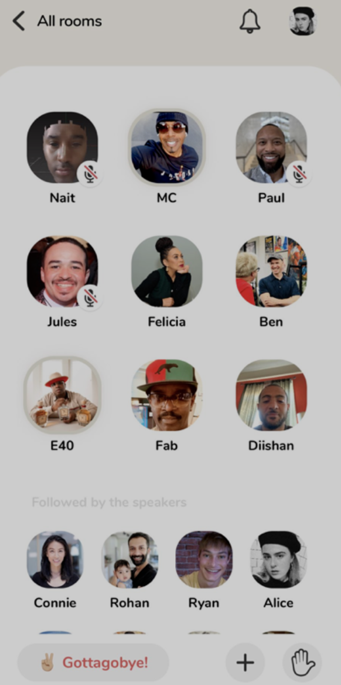
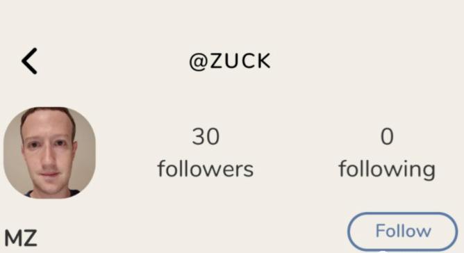
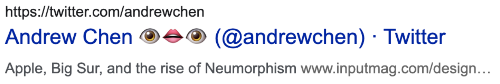
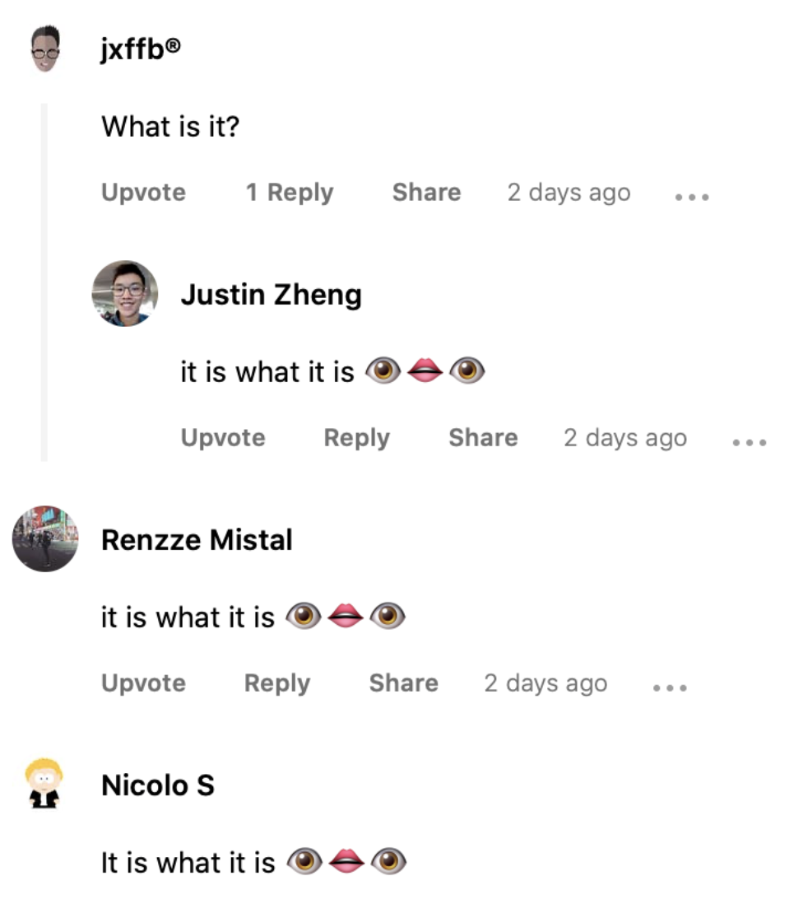
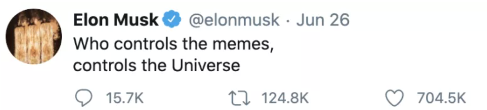
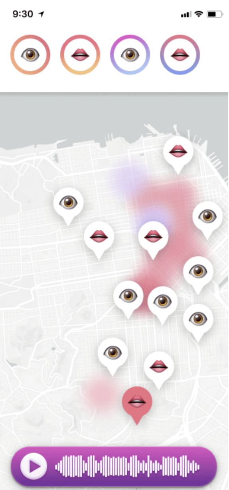
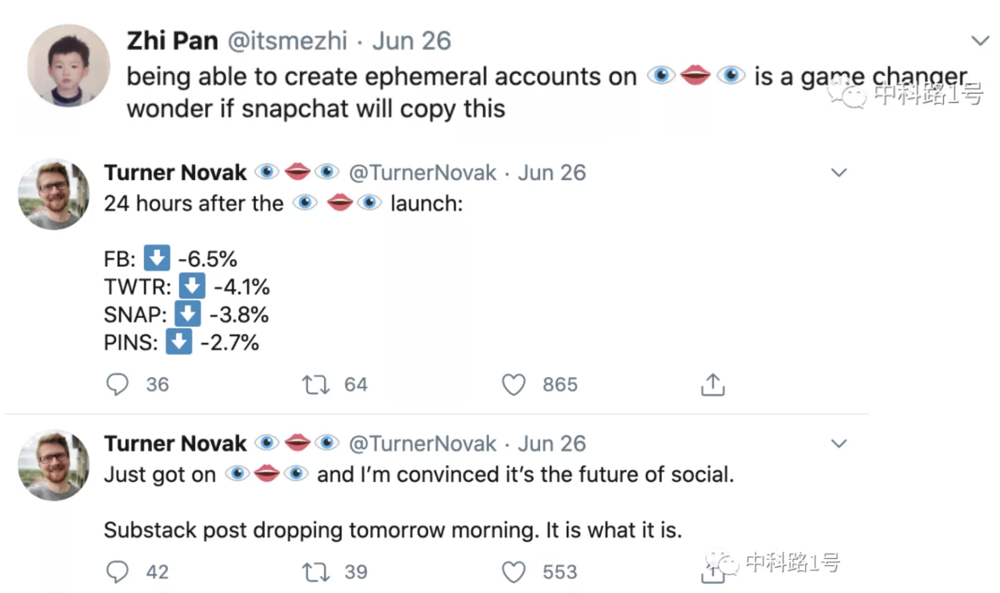

据说樊登在年轻时花 20 块钱买了一本讲述如何通过网络快速传播，利用传媒扩大影响力的书，大受启发。随后在 2015 年创立樊登读书会，通过网络分享书本知识，如今读书会已拥有 1800 多万用户，市值达到十几亿，樊登也成为中国知识付费“四大天王”之一，如今也是能和李厂长一起直播带货的人物了。

樊登读的这本书叫《疯传》（*Contagious: Why Things Catch On*），作者 Jonah Berger 为宾夕法尼亚大学沃顿商学院市场营销学教授。他将产品、思想、行为像病毒一样传播的条件归纳为六个原则。这本书也被营销行业奉为经典，是个不错的做 case study 的材料。

理论终究是理论，最新的实战经验总是让人最有收获。最近短短一个多月，美国有三个产品在社交媒体上疯狂传播，吸引了足够的流量和噱头。这篇我们来 review 其中的两个 social app。

三个 app 分别为：👁👄👁、Clubhouse、Hey Email

## Clubhouse

我大概在四月份中旬开始注意到 Clubhouse 这款产品，最初是有人在 Clubhouse 上面发现一个用户冒充扎克伯格，抢占了这个 ID，随后 TechCrunch 发布了一篇关于 Clubhouse 的报道，除此之外当时我没能找到关于它的更多信息。

直到一个月后的五月中旬，福布斯报道 Clubhouse 已经拿到了 Andreessen Horowitz 的 A 轮融资，估值超过 1 亿美元，然而产品还未正式上架，开发时间只有两个月，内测用户也只有 5000 名。

随后很多中文自媒体开始纷纷洗稿 Substack 中独立分析师的内容，像模像样地分析起来，我收到很多朋友把这些文章转发给我，但可惜他们只洗出了形，没有洗出神，甚至连基本的产品都没搞明白，这导致我最近甚至开始觉得整合垂直行业的洗英文稿的自媒体成 MCN 是个不错的 idea。

Clubhouse 到底是什么？它是一个实时语音聊天房构成的社交媒体，你可以关注别人，在别人的语音房间中听主播聊天，也可以举手发言。

一句话总结，就是语音直播。那么 Clubhouse 有什么不一样？在深入研究后，我找到了 Clubhouse 的种子用户，在他们收到的邀请函中，Clubhouse 是这样介绍自己的：

> Clubhouse is a community for casual, drop-in audio conversations.

短短两个词概括了 Clubhouse 的特点，这也是和中国那些语音房产品的主要区别。

什么是 casual 和 drop-in？

拿 Zoom 举例，发起人是有明确诉求的，比如我们是开一个会，还是办一个线上讲座，这时的参会者也是有明确诉求的，他们是知道某人要在某个时间在这个 Zoom 房间里办讲座。Zoom 占据的是用户的特定时间，这是一个有明确诉求的场景。

在 Clubhouse 中，当你关注的人开始进入语音房聊天时，你会收到一条通知。而你在这时是没有任何心理准备的，你不知道房间中有谁，也不知道他要聊什么。由于 Clubhouse 里所有内容均没有回放，你的选择只有两个：要么立即进入房间，要么错过。

此外，用户也会在 hang out 时进入 Clubhouse 中选择语音房听人闲聊。比如有个房间的主播把手机放到鸟笼旁边，他的鸟能发出好听的叫声，于是每天很多人 hang out 时会进到这个房间里听鸟叫。因此 Clubhouse 占用的是用户的闲暇时间，这是一个没有明确诉求的场景，就像出租车司机开车时的闲聊电台。

我认为 Clubhouse 能够 take off 的原因有三个：

**第一，以精英人群作为种子用户。**在 Clubhouse 种子用户中，几乎全是来自美国创投圈的名人，他们要么是知名投资机构的投资人，要么是科技公司、创业公司 C-level 的高管。这样的好处一是他们都自带流量，能够引起社交媒体上的传播；二是这些人聊天的内容质量会相当的高。想象一下如果你在 Clubhouse 上关注了马云，能够听马云和他的朋友聊天，甚至还有可能邀请你上来和他一起聊，有谁会拒绝这样的机会呢？

能够触及这批精英人群也是 Clubhouse 团队的能力。两个创始人都是很有经验的创业者，种子轮的投资阵容也十分豪华。这让一些硅谷创业公司的创始人开始抱怨到：“Clubhouse 再次验证了硅谷是一个靠关系的社会。”

**第二，制造 FOMO。**Clubhouse 采用邀请制，会关联你的 Twitter 账号，如果你是个普通用户，那么目前没有任何机会使用到 Clubhouse，你只会每天在网上看到别人今天跟这个明星聊天，明天跟那个明星聊天，但自己根本拿不到邀请。这成功地引起了人们的好奇：怎么才能使用 Clubhouse？

制造 FOMO 还体现在“实时”上，也就是刚才说的如果你现在不听，那么就会永远错过。我有个朋友把这个 feature 和 Snapchat 的 Stories 功能对比，两者一个听觉，一个视觉，都是让用户害怕错过，我觉得这个类比非常有趣。（Snapchat Stories 是 2013 年推出的功能，这是一个 24 小时阅后即焚的朋友圈，可以发照片、视频和 Gif 图片，这个功能已经被很多 app 抄遍了。）

**第三，美国市场用户良好的音频内容摄入习惯。**实时语音跟播客很像，只是一个是随意的、一个是正式的。某种程度上，Clubhouse 是播客的竞品。美国已经有着成熟的 Podcast 工业，用户也有良好的使用习惯，对于一个纯音频的 app 的接受度是比较高的。

以上三点让 Clubhouse 变得流行，据说早期用户每天使用时常在 8 个小时左右，就连 Ben Horowitz 也说 “When people open it, they use for a long time”. 关于 Clubhouse 的更多分析（比如商业化），我将其放在了文末。

## 👁👄👁

这个产品叫 👁👄👁（因为公众号标题不支持 emoji，我只能使用了英文 EyeMouthEye 代替），它的用户会把自己的推特名字后面加上这三个 emoji ：

如果你问它的用户，这个产品是个啥？

他们会有统一的回复：**It is what it is** 👁👄👁

打开官网（https://xn--mp8hai.fm/）会发现同样是邀请制注册，不同的是，如果你选择向公益组织捐赠资金支持 BLM 运动，你可能会更快地得到邀请。

又一个制造 FOMO 的大师。不同的是，它还制造了 meme 传播，仅包含三个 emoji 和一句 "It is what it is"。仿佛在说，“懂的自然懂，不懂的话，我只能告诉你，It is what it is 👁👄👁“。就连 Elon Musk 也评论到：

从网上 po 出来的界面图片看来，这个 app 似乎是基于 LBS 的音频社交软件：

用户的反应也十分好：

人们开始认为这又是一款像 Clubhouse 一样制造 FOMO 的产品，只是 👁👄👁 更有经验，将社交媒体的名字作为广告板。那么这个被评为 ‘game changer’， ‘future of social‘ 的 app 到底是什么呢？直到昨天，官网发生了变化。

**原来，这是一个不存在的产品。**

在官网的 statement 中（https://xn--mp8hai.fm/statement），👁👄👁 团队为我们揭开了迷底：

👁👄👁 这个 meme 最初在 TikTok 上传播，后来有几个人开始把自己的推特名字后加上 👁👄👁，组成了一个小团体，所有改了名字的人都可以加入这个 group。结果人越来越多，大家想做点什么，便和最近的 BLM 种族运动联系起来，借这个不存在的产品来号召大家关注种族主义，目前已经为三个种族主义慈善机构筹得 11 万美元，并且捐款运动还在进行中。

所有人都被愚弄了。没有产品，没有创业公司，没有种子用户，有的只是一个 joke。我推荐每个人都应该读读这篇 statement，这将每个人的科技期待变成了一种普世的人文关怀。

我也不例外，把这两个产品放到一起原本是准备总结一下创造病毒式传播的经验，从这个角度看，👁👄👁 其实更为成功，只是他不是一个商业组织策划的，但我们仍然可以从中有所收获：

**第一，制造 FOMO 屡试不爽。**可以在运营上，如邀请制、创造 meme、与公益组织联动、抓住实时热点；也可以在产品上，如 Snapchat Stories 和 Clubhouse 的 real time audio room. 因此找到早期的一小批种子用户并营造一种 exclusive 的氛围十分重要。

**第二，TestFlight 冷启动将变得流行。**Clubhouse 上线至今仍然采用 TestFlight （苹果的软件测试平台），没有上线 App Store；网上流传的所谓的 👁👄👁 也是通过 TestFlight 发布的。这有什么好处？

1. 可以邀请指定用户使用，其他人连 app 主页和用户评论都看不到，创造 FOMO。
2. TestFlight 内购都是假的，实际支付走外部支付方式的话，没有苹果抽成 30%。
3. 审核时间较 App Store 短，利于快速迭代 MVP。

**第三，voice-first 将成为 consumer tech 上的新趋势。**现在其实很多 VC 已经不看社交赛道了，因为早期项目跑出来确实太难，相比之下企业服务显得更加踏实一些。但是伴随着以 AirPods 为代表的真无线耳机、苹果即将发布的 AR 眼镜等硬件的发展，与以 NLP 和 Speech 为代表的 AI 技术相辅相成，voice-first app 不需要占用用户的眼睛，全新的交互场景与用户体验能够在新的维度上对现有的 super consumer app 造成冲击。

比如在 iOS 14 Preview 中，我发现苹果即将开放 AirPods 的物理数据给开发者：

这一方面是在为 Apple AR Glasses 的 app 做铺垫，另一方面也为其他 app，尤其是 voice-first trend 中的产品带来全新的交互体验，而如此重要的一条居然在 WWDC 发布会上没有被提及。

---

## References

- https://techcrunch.com/2020/04/18/clubhouse-app-chat-rooms/
- https://www.forbes.com/sites/alexkonrad/2020/05/15/andreessen-horowitz-wins-vc-sweepstakes-to-back-clubhouse-voice-app/
- https://aha.substack.com/p/5-clubhouse
- https://divinations.substack.com/p/inside-the-clubhouse
- https://www.forbes.com/sites/paularmstrongtech/2020/06/26/what-is--oh-it-is-what-it-is
- https://www.theverge.com/2020/6/27/21305646/it-is-what-it-is-fake-app-twitter-tiktok-meme
- https://constine.substack.com/p/what-does-mean-well