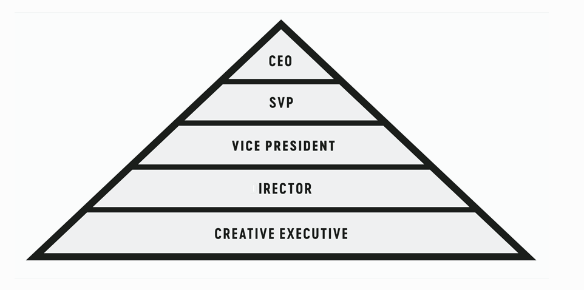
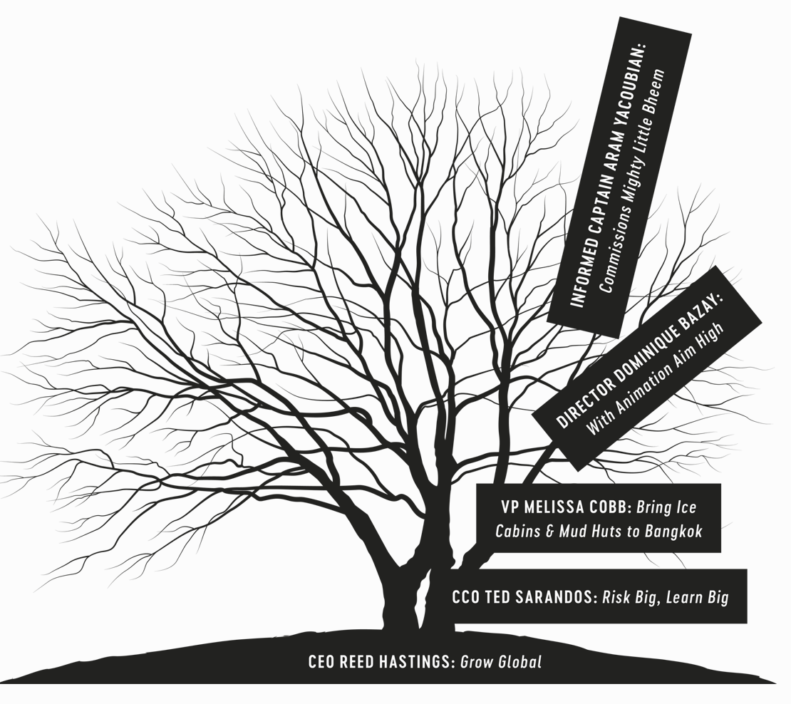
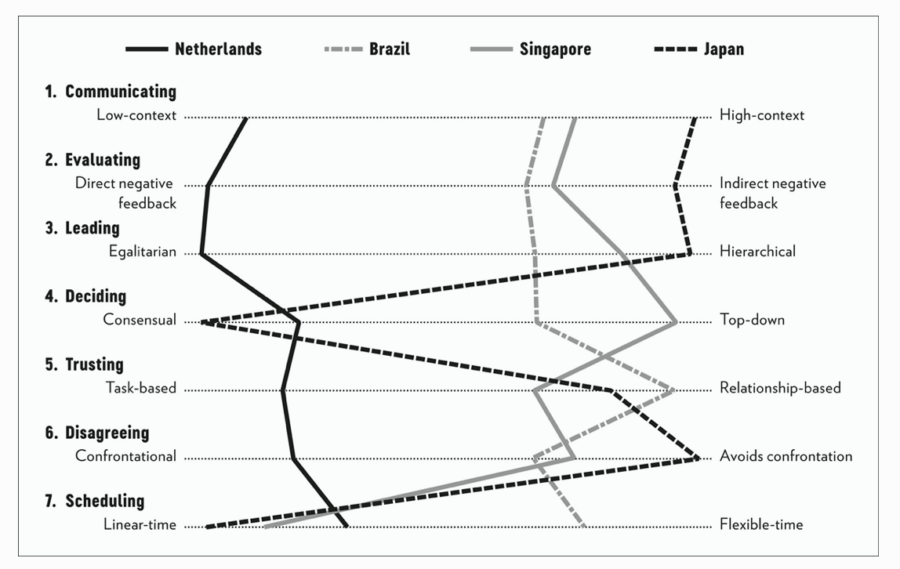
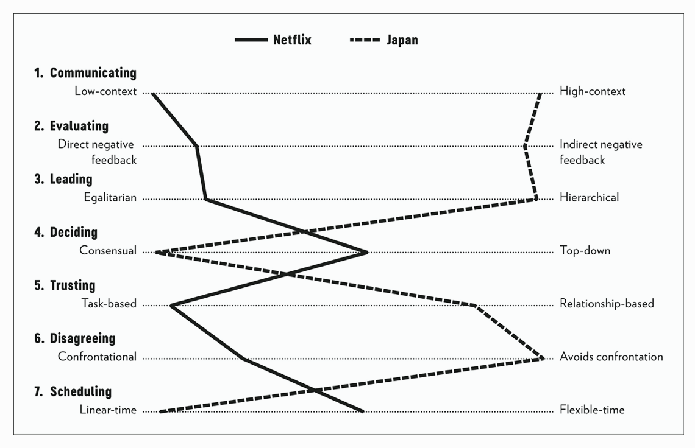
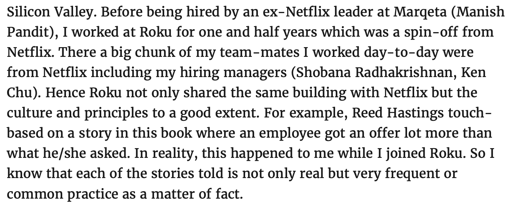

> 如果你想造一艘船，不要抓一批人来搜集材料，不要指挥他们做这个做那个，你只要教他们如何渴望大海就够了。 
>
> —— 安东尼·德·圣-埃克苏佩里 《小王子》

Netflix 官方出版过三本书：

第一本《奈飞文化手册》作者是 Netflix 前 CHO，里面主要深入解析了 2009 年风靡硅谷的 Netflix Culture Deck，这份 Deck 被 Facebook CFO 谢丽尔·桑德伯格称为“硅谷的重要文件”，其中第一条准则“只招聘成年人”成为了许多创业公司的信条。
第二本是我之前写过的[《复盘网飞》](http://mp.weixin.qq.com/s?__biz=MzA3MzExNzI2Mg==&mid=2247484350&idx=1&sn=76a99466a2769db4fcc612fe9870f146&chksm=9f12b89fa8653189ef404532b5105efa3eaeaa4bd3ccd4c12aab498fa46c45c728d1ee72d465&scene=21#wechat_redirect)，它的作者是 Netflix 早期的联合创始人，首任 CEO 马克·伦道夫，这里面主要讲述了 Netflix 从成立到上市的过程，时间跨度很小，因为马克·伦道夫后来离开了公司，从书中的口吻能看出他心有不甘，似乎并不是主动想离开 Netflix。《复盘网飞》偏向于 storytelling，跟管理和文化关系不大。

第三本是今天要讲的《没有规则的规则》（No Rules Rules），作者是联合创始人，现任 co-CEO Reed Hastings 和欧洲工商管理学院教授 Erin Meyer。这本仍然是介绍 Netflix 的企业文化，但比《奈飞文化手册》更为具体、深入和生动。书中 Reed Hastings 负责主要介绍 Netflix 各个文化的诞生和应用，Erin Meyer 教授则负责提供与员工的访谈和商学院案例作为支撑。

如果说几年前第一次读《奈飞文化手册》带给我的是憧憬与向往，那么《No Rules Rules》带给我的更多是不可思议和难以置信，因为每一章都是让我张着嘴读完的。这完全不像是现实世界中的公司！

## **Freedom & Responsibility**

自由与责任（F&R）是 Netflix 的文化核心。

**1. 建设人才密度（talent density）。**

在 2001 年初的 dot com 泡沫中，Netflix 募不到资金不得不裁员三分之一。让 Reed 没有想到的是，裁员后剩下的员工工作热情更高了，整个团队充满了能量和新点子，公司业务也增长飞快。Reed 得出结论：优秀的人会让团队中其他人工作更有效率。对于顶级员工来说，一个好的工作环境不是宽敞的办公室，不是漂亮的健身房，也不是好吃的寿司饭，而是被其他优秀人才围绕着的快乐。

**2. 提升坦诚度。**

这意味着组织中的每个人都要说出你心里真正所想的事情。这意味着不管对老板还是对同事，如果你觉得他哪里做的不好，就一定要当面当时表达出来。这些建议应该是善意的、可执行的，接受者应该是感激的，并且可以不采纳。乔布斯也说过类似的话：“A 级人才的自尊心，不需要呵护”。

**3. 移除限制。**

**a) 不限制休假。**

2003 年之前的 Netflix 和其他公司一样，规定每个人的休假天数。直到有一天一个员工对 Reed 说：“我们周末也会工作，个人时间也会回复邮件，但这些工作时间都没被追踪到，那为什么要限制我们每年的休假天数？” 从此 Netflix 员工是否休假、休假多久都可以由自己决定，Reed 本人一年至少休假 6 周。

**b)不限制差旅和报销费用。**
这也能提升员工的自由度，帮助他们更快地做出有助于公司的决策。当你相信别人时，别人也会展示出他们值得相信的地方。

**4. 支付市场上的顶薪。**

多数公司使用的基于绩效的奖金模式不适用于创意人才，因此 Netflix 里面没有奖金，这部分都已经体现在工资里。Netflix 鼓励你去接猎头的电话、甚至去其他公司面试，如果得到更高的薪水，告诉公司，公司会为你涨薪。

**5. 自我披露。**

自我披露可以建立信任，寻求帮助可以促进学习，承认错误可以促进宽恕，而广播自己的失败则可以鼓励员工勇往直前。当你成功时，轻声谈论它或让其他人为你提及它。但是，当你犯错时，请大声说出来，以便每个人都可以从错误中学习并受益。

**6. 移除决策批准的限制。**

Netflix 鼓励“工作不是为了取悦老板，而是为了公司变得更好”，每位员工都有很大的决策权，不需要领导批准。

**7. 留任者测试（The Keeper Test）。**

Reed 认为组织中的人不应该像家人一样工作，而是应该像顶级体育运动队伍一样。Netflix 不会为员工绩效打分，也不会按照绩效排序后末位淘汰，因为 Netflix 鼓励员工去和公司的竞争对手竞争，而不是自己的员工内部互相竞争。Netflix 让所有经理思考：如果有天你的员工要离开公司，你是会极力挽留他，还是会接受他的辞职甚至有点开心？如果是后者，你应该现在就让他走人并且给予辞退赔偿金！

**8. 反馈圆圈。**

360 评估：员工之间要互相写反馈，指出对方哪里做的好，哪里做的不好，哪里可以做的更好。实时 360：所有人在饭桌上接受别人的实时反馈和建议。360 评估也被很多中国互联网公司采用。

**9. 管理者提供上下文，而不是控制。**

这个对应到文章开头《小王子》中的诗。

普通公司的管理是金字塔式，下层员工的决策要得到上层的批准：

而在 Netflix 中，管理流程是树形的：

这种管理模式领导者提供的是上下文，起到根基作用，而做出最后决策的是底层员工。如果最终决策失败，领导者要考虑是自己的上下文是否提供的充分全面，而不应该责备下属。

**10. 走向世界。**

Netflix 是诞生于美国的互联网公司，当它走向世界时却发现不同国家的人都有不同的文化：

比如 Netflix 和日本的文化在沟通、评估、领导、决策、信任、冲突、计划等 7 个维度上都有非常大的区别：

这需要将公司原有的文化映射到国家的文化上，鼓励大家公开谈论文化的不同来互相理解。

Reed 认为，互联网公司是创意人才聚集的地方，这样的组织应该采用爵士乐一样的管理方式：爵士强调个人自发性，音乐家知道这首歌的整体结构，但可以自由即兴创作，互相激励，创作出令人赞叹的音乐。而不应该采用交响乐式的管理方式：以规则和流程为首。

## 10 dots

2005 年的夏天，乔布斯在斯坦福大学的毕业演讲中讲述了自己退学后旁听书法课时，学到了如何排版出漂亮的板式的故事。乔布斯在最初根本没有考虑到这些知识会在他的生命中有什么实际价值，直到他设计 Mac 电脑时将其全部运用到其中。因此，乔布斯认为：

> 你不可能充满预见地将生命的点滴（dots）串联起来；只有在你回头看的时候，你才发现这些点点滴滴之间的联系。所以，你要坚信，你现在所经历的将在你未来的生命中串联起来。你不得不相信某些东西，你的直觉、命运、生活、因缘际会……正是这种信仰让我不会失去希望，它让我的人生变得与众不同。

连接生活中点滴（dots）的方式决定了我们认识世界、做出决策和得到结论的方式，如果你运用不同的方式连接点滴（dots）就会得到对世界完全不同的理解，Netflix 的文化同样如此：它们不是一次性精心设计出来的，而是 Reed Hastings 和团队从生活中不断思考和实践得出的一个个结论，渐渐地这些元素自然而然地连接起来，成为了驱动 Netflix 成功的重要因素。

因此，Netflix 的文化是相互依赖的，比如说，只有招到了最好的人，你才会为他设置顶薪；只有组织人才密度高，底层人才能够自己作出决策；如果一线员工能尽快作出决策，这就能够促进整个组织的高效运转……

Reed 将所有 dots 连接起来形成了 Netflix 的独特文化，盲目地搬运这些 dots 一定不会形成下一个 Netflix，这需要你去连接自己脑海中的 dots，而不是去连接 Reed 脑海中的 dots。

我最大的问题是，这些文化都是真实的吗？这十条别说中国互联网公司，就是全世界互联网公司应该都很难做到。直到我发现了一篇评论（来源：http://www.dragon-bishop.com/2020/09/no-rules-rules-by-reed-hastings-and.html）：

这是一个 Roku 前员工（从 Netflix 内部分拆的智能电视公司），他的同事都是 Netflix 出来的人，在他入职时确实像书中说的一样得到了比他要求更高的薪水。“each of the stories told is not only real but very frequent or common practice as a matter of fact”，没有比这更好的评价。

有意思的是，Reed Hastings 是 work from home 坚定反对者，在 9 月份和《华尔街日报》的采访中，他认为 WFH 是 “pure negative” 没有任何好处的，甚至希望员工“疫苗被批准后 12 小时后就来办公室上班”。这似乎与他坚持的“自由与责任”相悖。